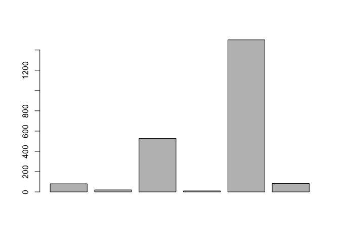
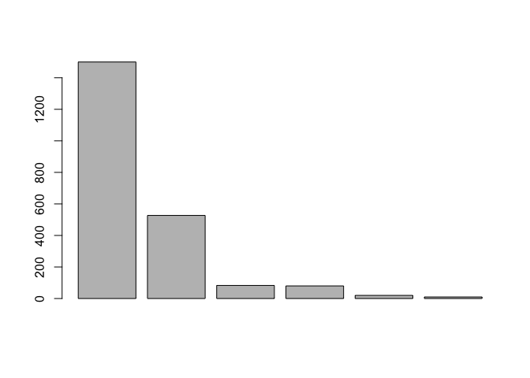
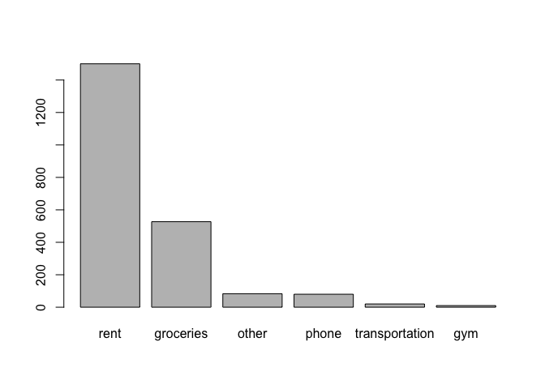

lab01-hongling-lei.Rmd
================

``` r
phone <- 80
transportation <- 20
groceries <- 527
gym <- 10
rent <- 1500
other <- 83
total = phone + transportation + groceries + gym + rent + other
total
```

    ## [1] 2220

``` r
semester_total <- total*5
semester_total
```

    ## [1] 11100

``` r
year_total <- total*10
year_total
```

    ## [1] 22200

``` r
expenses <- c(phone, transportation, groceries, gym, rent, other)
barplot(expenses)
```



``` r
barplot(sort(expenses, decreasing=TRUE))
```



``` r
names(expenses) <- c('phone','transportation','groceries','gym','rent','other')
barplot(sort(expenses, decreasing=TRUE))
```



``` r
a = 3
b = 4
c = sqrt(a^2 + b^2)
c
```

    ## [1] 5

``` r
# Let’s consider a simple example. A fair coin is tossed 5 times. What is the probability of getting exactly 2 heads?
# Create the objects n, k, and p for the number of trials, the number of success, and the probability of success, respectively.
n = 5
k = 2
p = 1/2 # Since it is a fair dice
# Use factorial() to compute the number of combinations “n choose k”
n_choose_k = factorial(n) / (factorial(k)*factorial(n-k))
# Apply the binomial formula, using factorial(), to calculate the probability of getting exactly 2 heads out of 5 tosses.
Pr1 = n_choose_k * p^k * (1-p)^(n-k)
Pr1
```

    ## [1] 0.3125

``` r
# Recalculate the same probability but now using choose() (instead of factorial())
Pr2 = choose(n=5, k=2) * p^k * (1-p)^(n-k)
Pr2
```

    ## [1] 0.3125

``` r
# Consider rolling a fair die 10 times. What is the probability of getting exactly 3 sixes?
n = 10
k = 3
Pr3 = choose(n=10, k=3) * p^k * (1-p)^(n-k)
Pr3
```

    ## [1] 0.1171875

``` r
# Now look for help documentation (e.g. help.search() or ??) using the keyword binomial: binomial.
??binomial
help.search("binomial")
# You should get a list of topics related with the searched term binomial.
# Choose the one related with the Binomial Distribution, which is part of the R package stats (i.e. stats::Binomial).
# Read the documentation and figure out how to use the dbinom() function to obtain the above probabilities: 2 heads in 5 coin tosses, and 3 sixes in 3 rolls of a die.
Pr4 = dbinom(2, 5, 1/2, log = FALSE)
Pr4
```

    ## [1] 0.3125

``` r
Pr5 = dbinom(3, 3, 1/6, log = FALSE)
Pr5
```

    ## [1] 0.00462963

``` r
# How would you modify the previous binomial function to calculate the same probability (2 heads in 5 tosses) of a biased coin with a chance of heads of 35%?
Pr6 = dbinom(2, 5, 0.35, log = FALSE)
Pr6
```

    ## [1] 0.3364156

``` r
Pr7 = dbinom(3, 3, 0.35, log = FALSE)
Pr7
```

    ## [1] 0.042875

``` r
# Finally, obtain the probability of getting more than 3 heads in 5 tosses with a biased coin of 35% chance of heads.Apply the binomial formula, using factorial(), to calculate the probability of getting exactly 2 heads out of 5 tosses.
Pr8 = factorial(5) / (factorial(4)*factorial(1)) * 0.35^4 * (1-0.35)^1 # the probability that exactly 4 heads out of 5 tosses
Pr9 = factorial(5) / (factorial(5)*factorial(0)) * 0.35^5 * (1-0.35)^0 # the probability that exactly 5 heads out of 5 tosses
Pr10 = Pr8 + Pr9 # the probability that more than 3 heads out of 5 tosses
Pr10
```

    ## [1] 0.0540225

Note that the `echo = FALSE` parameter was added to the code chunk to prevent printing of the R code that generated the plot.
