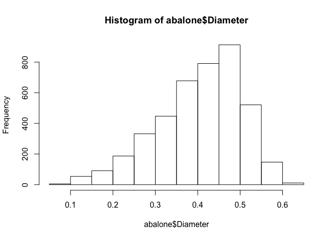

lab03-hongling-lei
================

Lab 3: Data Frame Basics
========================

Abalone Data Set
================

1.  What’s the character delimiter?
    The character delimiter is comma.
2.  Is there a row for column names?
    No.
3.  Are there any missing values?
    No.
4.  What is the data type of each column?
    Nominal, continuous, continuous, continuous, continuous, continuous, continuous, continuous, integer.

Basic Importing
===============

``` r
url <- "http://archive.ics.uci.edu/ml/machine-learning-databases/abalone/abalone.data"
# download it to your working directory
origin <- 'http://archive.ics.uci.edu/ml/machine-learning-databases/abalone/abalone.data'
destination <- 'abalone.data'
download.file(origin, destination)

abalone <- read.table(url, sep = ",")
# Another way to import the data
abalone <- read.table("abalone.data", sep = ",")
# take a peek of first rows
head(abalone)
```

    ##   V1    V2    V3    V4     V5     V6     V7    V8 V9
    ## 1  M 0.455 0.365 0.095 0.5140 0.2245 0.1010 0.150 15
    ## 2  M 0.350 0.265 0.090 0.2255 0.0995 0.0485 0.070  7
    ## 3  F 0.530 0.420 0.135 0.6770 0.2565 0.1415 0.210  9
    ## 4  M 0.440 0.365 0.125 0.5160 0.2155 0.1140 0.155 10
    ## 5  I 0.330 0.255 0.080 0.2050 0.0895 0.0395 0.055  7
    ## 6  I 0.425 0.300 0.095 0.3515 0.1410 0.0775 0.120  8

``` r
# take a peek of last rows
tail(abalone)
```

    ##      V1    V2    V3    V4     V5     V6     V7     V8 V9
    ## 4172  M 0.560 0.430 0.155 0.8675 0.4000 0.1720 0.2290  8
    ## 4173  F 0.565 0.450 0.165 0.8870 0.3700 0.2390 0.2490 11
    ## 4174  M 0.590 0.440 0.135 0.9660 0.4390 0.2145 0.2605 10
    ## 4175  M 0.600 0.475 0.205 1.1760 0.5255 0.2875 0.3080  9
    ## 4176  F 0.625 0.485 0.150 1.0945 0.5310 0.2610 0.2960 10
    ## 4177  M 0.710 0.555 0.195 1.9485 0.9455 0.3765 0.4950 12

``` r
# check data frame's structure
str(abalone, vec.len = 1)
```

    ## 'data.frame':    4177 obs. of  9 variables:
    ##  $ V1: Factor w/ 3 levels "F","I","M": 3 3 ...
    ##  $ V2: num  0.455 0.35 ...
    ##  $ V3: num  0.365 0.265 ...
    ##  $ V4: num  0.095 0.09 ...
    ##  $ V5: num  0.514 ...
    ##  $ V6: num  0.225 ...
    ##  $ V7: num  0.101 0.0485 ...
    ##  $ V8: num  0.15 0.07 ...
    ##  $ V9: int  15 7 ...

``` r
column_names <- c("Sex", "Length", "Diameter", "Height", "Whole", "Shucked", "Viscera", "Shell", "Rings")
column_types <- c("character", "real", "real", "real", "real", "real", "real", "real", "integer")
abalone <- read.table("abalone.data", sep = ",", col.names = column_names, colClasses = column_types)
str(abalone)
```

    ## 'data.frame':    4177 obs. of  9 variables:
    ##  $ Sex     : chr  "M" "M" "F" "M" ...
    ##  $ Length  : num  0.455 0.35 0.53 0.44 0.33 0.425 0.53 0.545 0.475 0.55 ...
    ##  $ Diameter: num  0.365 0.265 0.42 0.365 0.255 0.3 0.415 0.425 0.37 0.44 ...
    ##  $ Height  : num  0.095 0.09 0.135 0.125 0.08 0.095 0.15 0.125 0.125 0.15 ...
    ##  $ Whole   : num  0.514 0.226 0.677 0.516 0.205 ...
    ##  $ Shucked : num  0.2245 0.0995 0.2565 0.2155 0.0895 ...
    ##  $ Viscera : num  0.101 0.0485 0.1415 0.114 0.0395 ...
    ##  $ Shell   : num  0.15 0.07 0.21 0.155 0.055 0.12 0.33 0.26 0.165 0.32 ...
    ##  $ Rings   : int  15 7 9 10 7 8 20 16 9 19 ...

``` r
abalone2 <- read.csv("abalone.data", sep = ",", col.names = column_names, colClasses = column_types, header = FALSE)
str(abalone2)
```

    ## 'data.frame':    4177 obs. of  9 variables:
    ##  $ Sex     : chr  "M" "M" "F" "M" ...
    ##  $ Length  : num  0.455 0.35 0.53 0.44 0.33 0.425 0.53 0.545 0.475 0.55 ...
    ##  $ Diameter: num  0.365 0.265 0.42 0.365 0.255 0.3 0.415 0.425 0.37 0.44 ...
    ##  $ Height  : num  0.095 0.09 0.135 0.125 0.08 0.095 0.15 0.125 0.125 0.15 ...
    ##  $ Whole   : num  0.514 0.226 0.677 0.516 0.205 ...
    ##  $ Shucked : num  0.2245 0.0995 0.2565 0.2155 0.0895 ...
    ##  $ Viscera : num  0.101 0.0485 0.1415 0.114 0.0395 ...
    ##  $ Shell   : num  0.15 0.07 0.21 0.155 0.055 0.12 0.33 0.26 0.165 0.32 ...
    ##  $ Rings   : int  15 7 9 10 7 8 20 16 9 19 ...

``` r
abalone10 <- head(abalone, 10)
str(abalone10)
```

    ## 'data.frame':    10 obs. of  9 variables:
    ##  $ Sex     : chr  "M" "M" "F" "M" ...
    ##  $ Length  : num  0.455 0.35 0.53 0.44 0.33 0.425 0.53 0.545 0.475 0.55
    ##  $ Diameter: num  0.365 0.265 0.42 0.365 0.255 0.3 0.415 0.425 0.37 0.44
    ##  $ Height  : num  0.095 0.09 0.135 0.125 0.08 0.095 0.15 0.125 0.125 0.15
    ##  $ Whole   : num  0.514 0.226 0.677 0.516 0.205 ...
    ##  $ Shucked : num  0.2245 0.0995 0.2565 0.2155 0.0895 ...
    ##  $ Viscera : num  0.101 0.0485 0.1415 0.114 0.0395 ...
    ##  $ Shell   : num  0.15 0.07 0.21 0.155 0.055 0.12 0.33 0.26 0.165 0.32
    ##  $ Rings   : int  15 7 9 10 7 8 20 16 9 19

``` r
abalone20 <- read.table("abalone.data", sep = ",", skip = 10, nrows = 10, col.names = column_names, colClasses = column_types)
str(abalone20)
```

    ## 'data.frame':    10 obs. of  9 variables:
    ##  $ Sex     : chr  "F" "M" "M" "F" ...
    ##  $ Length  : num  0.525 0.43 0.49 0.535 0.47 0.5 0.355 0.44 0.365 0.45
    ##  $ Diameter: num  0.38 0.35 0.38 0.405 0.355 0.4 0.28 0.34 0.295 0.32
    ##  $ Height  : num  0.14 0.11 0.135 0.145 0.1 0.13 0.085 0.1 0.08 0.1
    ##  $ Whole   : num  0.607 0.406 0.541 0.684 0.475 ...
    ##  $ Shucked : num  0.194 0.168 0.217 0.273 0.168 ...
    ##  $ Viscera : num  0.1475 0.081 0.095 0.171 0.0805 ...
    ##  $ Shell   : num  0.21 0.135 0.19 0.205 0.185 0.24 0.115 0.13 0.1 0.115
    ##  $ Rings   : int  14 10 11 10 10 12 7 10 7 9

**The document is like this:**
"character. A vector of classes to be assumed for the columns. If unnamed, recycled as necessary. If named, names are matched with unspecified values being taken to be NA. Possible values are NA (the default, when type.convert is used), "NULL" (when the column is skipped), one of the atomic vector classes (logical, integer, numeric, complex, character, raw), or "factor", "Date" or "POSIXct". Otherwise there needs to be an as method (from package methods) for conversion from "character" to the specified formal class. Note that colClasses is specified per column (not per variable) and so includes the column of row names (if any)."
**What happens when you specify the data-type of one or more columns as "NULL"?**
The column will be skipped.

``` r
str(abalone)
```

    ## 'data.frame':    4177 obs. of  9 variables:
    ##  $ Sex     : chr  "M" "M" "F" "M" ...
    ##  $ Length  : num  0.455 0.35 0.53 0.44 0.33 0.425 0.53 0.545 0.475 0.55 ...
    ##  $ Diameter: num  0.365 0.265 0.42 0.365 0.255 0.3 0.415 0.425 0.37 0.44 ...
    ##  $ Height  : num  0.095 0.09 0.135 0.125 0.08 0.095 0.15 0.125 0.125 0.15 ...
    ##  $ Whole   : num  0.514 0.226 0.677 0.516 0.205 ...
    ##  $ Shucked : num  0.2245 0.0995 0.2565 0.2155 0.0895 ...
    ##  $ Viscera : num  0.101 0.0485 0.1415 0.114 0.0395 ...
    ##  $ Shell   : num  0.15 0.07 0.21 0.155 0.055 0.12 0.33 0.26 0.165 0.32 ...
    ##  $ Rings   : int  15 7 9 10 7 8 20 16 9 19 ...

``` r
summary(abalone)
```

    ##      Sex                Length         Diameter          Height      
    ##  Length:4177        Min.   :0.075   Min.   :0.0550   Min.   :0.0000  
    ##  Class :character   1st Qu.:0.450   1st Qu.:0.3500   1st Qu.:0.1150  
    ##  Mode  :character   Median :0.545   Median :0.4250   Median :0.1400  
    ##                     Mean   :0.524   Mean   :0.4079   Mean   :0.1395  
    ##                     3rd Qu.:0.615   3rd Qu.:0.4800   3rd Qu.:0.1650  
    ##                     Max.   :0.815   Max.   :0.6500   Max.   :1.1300  
    ##      Whole           Shucked          Viscera           Shell       
    ##  Min.   :0.0020   Min.   :0.0010   Min.   :0.0005   Min.   :0.0015  
    ##  1st Qu.:0.4415   1st Qu.:0.1860   1st Qu.:0.0935   1st Qu.:0.1300  
    ##  Median :0.7995   Median :0.3360   Median :0.1710   Median :0.2340  
    ##  Mean   :0.8287   Mean   :0.3594   Mean   :0.1806   Mean   :0.2388  
    ##  3rd Qu.:1.1530   3rd Qu.:0.5020   3rd Qu.:0.2530   3rd Qu.:0.3290  
    ##  Max.   :2.8255   Max.   :1.4880   Max.   :0.7600   Max.   :1.0050  
    ##      Rings       
    ##  Min.   : 1.000  
    ##  1st Qu.: 8.000  
    ##  Median : 9.000  
    ##  Mean   : 9.934  
    ##  3rd Qu.:11.000  
    ##  Max.   :29.000

``` r
head(abalone)
```

    ##   Sex Length Diameter Height  Whole Shucked Viscera Shell Rings
    ## 1   M  0.455    0.365  0.095 0.5140  0.2245  0.1010 0.150    15
    ## 2   M  0.350    0.265  0.090 0.2255  0.0995  0.0485 0.070     7
    ## 3   F  0.530    0.420  0.135 0.6770  0.2565  0.1415 0.210     9
    ## 4   M  0.440    0.365  0.125 0.5160  0.2155  0.1140 0.155    10
    ## 5   I  0.330    0.255  0.080 0.2050  0.0895  0.0395 0.055     7
    ## 6   I  0.425    0.300  0.095 0.3515  0.1410  0.0775 0.120     8

``` r
tail(abalone)
```

    ##      Sex Length Diameter Height  Whole Shucked Viscera  Shell Rings
    ## 4172   M  0.560    0.430  0.155 0.8675  0.4000  0.1720 0.2290     8
    ## 4173   F  0.565    0.450  0.165 0.8870  0.3700  0.2390 0.2490    11
    ## 4174   M  0.590    0.440  0.135 0.9660  0.4390  0.2145 0.2605    10
    ## 4175   M  0.600    0.475  0.205 1.1760  0.5255  0.2875 0.3080     9
    ## 4176   F  0.625    0.485  0.150 1.0945  0.5310  0.2610 0.2960    10
    ## 4177   M  0.710    0.555  0.195 1.9485  0.9455  0.3765 0.4950    12

``` r
dim(abalone)
```

    ## [1] 4177    9

``` r
names(abalone)
```

    ## [1] "Sex"      "Length"   "Diameter" "Height"   "Whole"    "Shucked" 
    ## [7] "Viscera"  "Shell"    "Rings"

``` r
colnames(abalone)
```

    ## [1] "Sex"      "Length"   "Diameter" "Height"   "Whole"    "Shucked" 
    ## [7] "Viscera"  "Shell"    "Rings"

``` r
nrow(abalone)
```

    ## [1] 4177

``` r
ncol(abalone)
```

    ## [1] 9

``` r
Min <- c(min(abalone$Length), min(abalone$Diameter), min(abalone$Height), min(abalone$Whole), min(abalone$Shucked), min(abalone$Viscera), min(abalone$Shell), min(abalone$Rings))
Max <- c(max(abalone$Length), max(abalone$Diameter), max(abalone$Height), max(abalone$Whole), max(abalone$Shucked), max(abalone$Viscera), max(abalone$Shell),max(abalone$Rings))
Mean <- c(mean(abalone$Length), mean(abalone$Diameter), mean(abalone$Height), mean(abalone$Whole), mean(abalone$Shucked), mean(abalone$Viscera), mean(abalone$Shell), mean(abalone$Rings))
SD <- c(sd(abalone$Length), sd(abalone$Diameter), sd(abalone$Height), sd(abalone$Whole), sd(abalone$Shucked), sd(abalone$Viscera), sd(abalone$Shell), sd(abalone$Rings))
mat <- rbind(Min,Max,Mean,SD)
colnames(mat) <- c("Length", "Diam", "Height", "Whole", "Shucked", "Viscera", "Shell", "Rings")
data.frame(mat)
```

    ##         Length       Diam     Height     Whole   Shucked   Viscera
    ## Min  0.0750000 0.05500000 0.00000000 0.0020000 0.0010000 0.0005000
    ## Max  0.8150000 0.65000000 1.13000000 2.8255000 1.4880000 0.7600000
    ## Mean 0.5239921 0.40788125 0.13951640 0.8287422 0.3593675 0.1805936
    ## SD   0.1200929 0.09923987 0.04182706 0.4903890 0.2219629 0.1096143
    ##          Shell     Rings
    ## Min  0.0015000  1.000000
    ## Max  1.0050000 29.000000
    ## Mean 0.2388309  9.933684
    ## SD   0.1392027  3.224169

Filtering, Slicing, and Selecting
=================================

``` r
# first three rows
three_rows <- abalone[1:3, ]
three_rows
```

    ##   Sex Length Diameter Height  Whole Shucked Viscera Shell Rings
    ## 1   M  0.455    0.365  0.095 0.5140  0.2245  0.1010  0.15    15
    ## 2   M  0.350    0.265  0.090 0.2255  0.0995  0.0485  0.07     7
    ## 3   F  0.530    0.420  0.135 0.6770  0.2565  0.1415  0.21     9

``` r
# subset rows given a condition
# (length greater than 0.6)
length_diam <- abalone[ ,c('Length', 'Diameter')]
head(length_diam)
```

    ##   Length Diameter
    ## 1  0.455    0.365
    ## 2  0.350    0.265
    ## 3  0.530    0.420
    ## 4  0.440    0.365
    ## 5  0.330    0.255
    ## 6  0.425    0.300

``` r
# slice the data by selecting the first 5 rows
abalone[1:5,]
```

    ##   Sex Length Diameter Height  Whole Shucked Viscera Shell Rings
    ## 1   M  0.455    0.365  0.095 0.5140  0.2245  0.1010 0.150    15
    ## 2   M  0.350    0.265  0.090 0.2255  0.0995  0.0485 0.070     7
    ## 3   F  0.530    0.420  0.135 0.6770  0.2565  0.1415 0.210     9
    ## 4   M  0.440    0.365  0.125 0.5160  0.2155  0.1140 0.155    10
    ## 5   I  0.330    0.255  0.080 0.2050  0.0895  0.0395 0.055     7

``` r
# slice the data by selecting rows 5, 10, 15, 20, 25, …, 50.
sliced_by_5 <- abalone[seq(5, 50, 5), ]
sliced_by_5
```

    ##    Sex Length Diameter Height  Whole Shucked Viscera Shell Rings
    ## 5    I  0.330    0.255  0.080 0.2050  0.0895  0.0395 0.055     7
    ## 10   F  0.550    0.440  0.150 0.8945  0.3145  0.1510 0.320    19
    ## 15   F  0.470    0.355  0.100 0.4755  0.1675  0.0805 0.185    10
    ## 20   M  0.450    0.320  0.100 0.3810  0.1705  0.0750 0.115     9
    ## 25   F  0.615    0.480  0.165 1.1615  0.5130  0.3010 0.305    10
    ## 30   M  0.575    0.425  0.140 0.8635  0.3930  0.2270 0.200    11
    ## 35   F  0.705    0.550  0.200 1.7095  0.6330  0.4115 0.490    13
    ## 40   M  0.355    0.290  0.090 0.3275  0.1340  0.0860 0.090     9
    ## 45   I  0.210    0.150  0.050 0.0420  0.0175  0.0125 0.015     4
    ## 50   F  0.525    0.425  0.160 0.8355  0.3545  0.2135 0.245     9

``` r
# slice the data by selecting the last 5 rows; try doing this without using tail(), and without hard coding the numbers of the alst five rows.
abalone[seq(nrow(abalone)-4, nrow(abalone), 1), ]
```

    ##      Sex Length Diameter Height  Whole Shucked Viscera  Shell Rings
    ## 4173   F  0.565    0.450  0.165 0.8870  0.3700  0.2390 0.2490    11
    ## 4174   M  0.590    0.440  0.135 0.9660  0.4390  0.2145 0.2605    10
    ## 4175   M  0.600    0.475  0.205 1.1760  0.5255  0.2875 0.3080     9
    ## 4176   F  0.625    0.485  0.150 1.0945  0.5310  0.2610 0.2960    10
    ## 4177   M  0.710    0.555  0.195 1.9485  0.9455  0.3765 0.4950    12

``` r
# create a data frame height14 by filtering the data with those abalones with Height less than 0.14, and display its dimensions with dim()
height14 <- data.frame(abalone[abalone$Height < 0.14, ])
dim(height14)
```

    ## [1] 1885    9

``` r
# create a data frame infant by filtering the data about Infant abalones, and display its dimensions with dim()
infant <- data.frame(abalone[abalone$Sex == "I", ])
dim(infant)
```

    ## [1] 1342    9

``` r
# create a data frame male_female by filtering the data with Male and Female abalones, and display its dimensions with dim()
male_female <- data.frame(abalone[abalone$Sex == "M" | abalone$Sex == "F", ])
dim(male_female)
```

    ## [1] 2835    9

``` r
# filter the data with those abalones with more than 25 Rings, displaying only their Sex, and Rings.
aba <- abalone[abalone$Rings >= 25, ]
aba$Sex
```

    ## [1] "M" "F" "M" "F" "F"

``` r
aba$Rings
```

    ## [1] 26 29 27 25 27

``` r
inf <- infant[infant$Rings > 3 & infant$Rings < 6, ]
inf$Sex
```

    ##   [1] "I" "I" "I" "I" "I" "I" "I" "I" "I" "I" "I" "I" "I" "I" "I" "I" "I"
    ##  [18] "I" "I" "I" "I" "I" "I" "I" "I" "I" "I" "I" "I" "I" "I" "I" "I" "I"
    ##  [35] "I" "I" "I" "I" "I" "I" "I" "I" "I" "I" "I" "I" "I" "I" "I" "I" "I"
    ##  [52] "I" "I" "I" "I" "I" "I" "I" "I" "I" "I" "I" "I" "I" "I" "I" "I" "I"
    ##  [69] "I" "I" "I" "I" "I" "I" "I" "I" "I" "I" "I" "I" "I" "I" "I" "I" "I"
    ##  [86] "I" "I" "I" "I" "I" "I" "I" "I" "I" "I" "I" "I" "I" "I" "I" "I" "I"
    ## [103] "I" "I" "I" "I" "I" "I" "I" "I" "I" "I" "I" "I" "I" "I" "I" "I" "I"
    ## [120] "I" "I" "I" "I" "I" "I" "I" "I" "I" "I" "I" "I" "I" "I" "I" "I" "I"
    ## [137] "I" "I" "I" "I" "I" "I" "I" "I" "I" "I" "I" "I" "I" "I" "I"

``` r
inf$Rings
```

    ##   [1] 5 5 4 4 5 5 4 5 5 4 5 5 5 4 4 4 5 4 5 5 5 5 5 5 4 4 4 5 5 5 4 4 5 4 5
    ##  [36] 5 5 5 4 4 4 4 4 5 5 5 5 4 5 5 5 5 5 5 5 5 4 5 5 5 5 4 5 5 5 5 5 5 5 5
    ##  [71] 5 5 5 4 4 4 5 5 5 5 5 5 4 5 4 5 5 5 5 5 4 5 4 4 5 4 5 5 4 5 5 4 4 5 5
    ## [106] 5 4 4 5 4 5 5 4 4 5 5 5 5 5 5 4 5 5 5 5 5 4 5 4 4 4 4 5 5 5 5 5 5 5 4
    ## [141] 5 5 4 4 5 5 4 5 4 5 4

``` r
inf$Diameter
```

    ##   [1] 0.175 0.150 0.150 0.190 0.195 0.130 0.130 0.160 0.210 0.160 0.120
    ##  [12] 0.200 0.175 0.195 0.210 0.145 0.210 0.145 0.205 0.220 0.175 0.165
    ##  [23] 0.125 0.190 0.110 0.105 0.125 0.155 0.185 0.175 0.180 0.120 0.230
    ##  [34] 0.235 0.220 0.240 0.250 0.320 0.130 0.135 0.155 0.165 0.180 0.180
    ##  [45] 0.210 0.220 0.265 0.205 0.185 0.190 0.215 0.225 0.230 0.230 0.205
    ##  [56] 0.255 0.270 0.290 0.280 0.270 0.290 0.165 0.255 0.300 0.295 0.320
    ##  [67] 0.340 0.170 0.210 0.255 0.260 0.175 0.135 0.180 0.130 0.110 0.150
    ##  [78] 0.210 0.190 0.195 0.215 0.250 0.095 0.200 0.115 0.150 0.215 0.200
    ##  [89] 0.180 0.185 0.145 0.210 0.150 0.170 0.180 0.195 0.210 0.220 0.160
    ## [100] 0.205 0.210 0.150 0.175 0.215 0.260 0.170 0.195 0.200 0.265 0.235
    ## [111] 0.205 0.280 0.185 0.170 0.170 0.215 0.220 0.275 0.135 0.165 0.150
    ## [122] 0.145 0.245 0.230 0.190 0.130 0.180 0.265 0.150 0.185 0.205 0.125
    ## [133] 0.300 0.220 0.225 0.220 0.130 0.205 0.205 0.105 0.235 0.250 0.105
    ## [144] 0.120 0.175 0.235 0.205 0.190 0.135 0.175 0.215

Adding new variables and Sorting rows
=====================================

``` r
# creating a small data frame
abies <- abalone[abalone$Sex == 'I', c('Length', 'Height', 'Diameter')]
abies$Ht_Len <- abies$Height / abies$Length
abies2 <- abies[order(abies$Length, decreasing = TRUE), ]
```

``` r
# using the data frame abies, add a new variable product with the product of Whole and Shucked.
abies4 <- abalone[abalone$Sex == 'I', c('Whole', 'Shucked')]
abies$Product = abies4$Whole * abies4$Shucked
# create a new data frame abies3, by adding columns log_height and log_length with the log transformations of height and length.
abies3 <- abalone[abalone$Sex == 'I', c('Length', 'Height', 'Diameter')]
abies3$log_height <- log(abies3$Height)
abies3$log_length <- log(abies3$Length)
# use the original data frame abalone to filter and arrange those abalones with height less than 0.12, in increasing order.
abalone <- read.table("abalone.data", sep = ",", col.names = column_names, colClasses = column_types)
abalone2 <- abalone[abalone$Height < 0.12, ]
str(abalone2[order(abalone2$Height, decreasing = FALSE), ])
```

    ## 'data.frame':    1156 obs. of  9 variables:
    ##  $ Sex     : chr  "I" "I" "I" "F" ...
    ##  $ Length  : num  0.43 0.315 0.075 0.635 0.165 0.165 0.16 0.15 0.16 0.16 ...
    ##  $ Diameter: num  0.34 0.23 0.055 0.495 0.115 0.11 0.12 0.1 0.11 0.11 ...
    ##  $ Height  : num  0 0 0.01 0.015 0.015 0.02 0.02 0.025 0.025 0.025 ...
    ##  $ Whole   : num  0.428 0.134 0.002 1.1565 0.0145 ...
    ##  $ Shucked : num  0.2065 0.0575 0.001 0.5115 0.0055 ...
    ##  $ Viscera : num  0.086 0.0285 0.0005 0.308 0.003 0.0025 0.0045 0.004 0.0055 0.005 ...
    ##  $ Shell   : num  0.115 0.3505 0.0015 0.2885 0.005 ...
    ##  $ Rings   : int  8 6 1 9 4 4 4 2 3 4 ...

``` r
# display a data frame with the Sex, Diameter, and Rings, of the top-5 highest abalones
temp <- abalone[order(abalone$Height, decreasing = TRUE), ]
temp[1:5, ]
```

    ##      Sex Length Diameter Height  Whole Shucked Viscera  Shell Rings
    ## 2052   F  0.455    0.355  1.130 0.5940  0.3320  0.1160 0.1335     8
    ## 1418   M  0.705    0.565  0.515 2.2100  1.1075  0.4865 0.5120    10
    ## 1429   F  0.815    0.650  0.250 2.2550  0.8905  0.4200 0.7975    14
    ## 1764   M  0.775    0.630  0.250 2.7795  1.3485  0.7600 0.5780    12
    ## 2180   F  0.595    0.470  0.250 1.2830  0.4620  0.2475 0.4450    14

``` r
# display a data frame with the Sex, Diameter, and Rings, of the top-5 longest abalones
temp <- abalone[order(abalone$Length, decreasing = TRUE), ]
temp[1:5, ]
```

    ##      Sex Length Diameter Height  Whole Shucked Viscera  Shell Rings
    ## 1429   F  0.815     0.65  0.250 2.2550  0.8905  0.4200 0.7975    14
    ## 2335   F  0.800     0.63  0.195 2.5260  0.9330  0.5900 0.6200    23
    ## 1210   F  0.780     0.63  0.215 2.6570  1.4880  0.4985 0.5860    11
    ## 3716   M  0.780     0.60  0.210 2.5480  1.1945  0.5745 0.6745    11
    ## 1764   M  0.775     0.63  0.250 2.7795  1.3485  0.7600 0.5780    12

Basic Plots
===========

``` r
table_sex <- table(abalone$Sex)
barplot(table_sex)
```


``` r
hist(abalone$Diameter)
```



``` r
boxplot(abalone$Diameter, horizontal = TRUE)
```


``` r
plot(abalone$Height)
```


``` r
plot(factor(abalone$Sex)) # We have to change the data type into factor to make the graph
```


``` r
plot(abalone$Height, abalone$Length)
```


``` r
plot(data.frame(abalone$Height, abalone$Length))
```


``` r
plot(data.frame(abalone$Height, abalone$Length, abalone$Diameter))
```


``` r
plot(data.frame(abalone$Sex, abalone$Length))
```


``` r
plot(data.frame(abalone$Length, abalone$Sex))
```

 \# Your Turn: Scatter Diagrams

``` r
plot.default(abalone$Height, abalone$Length, pch = 20, col = c("blue", "light yellow", "green", "pink"),
xlab = "Height", ylab = "Length", cex = 0.5,
main = "Relationship Between Height and Length of Abalones", 
sub = "According to UCI data")
```


