lab04-hongling-lei
================

### Installing packages

``` r
library(dplyr)
```

    ## Warning: package 'dplyr' was built under R version 3.4.4

    ## 
    ## Attaching package: 'dplyr'

    ## The following objects are masked from 'package:stats':
    ## 
    ##     filter, lag

    ## The following objects are masked from 'package:base':
    ## 
    ##     intersect, setdiff, setequal, union

``` r
library(ggplot2)
```

    ## Warning: package 'ggplot2' was built under R version 3.4.4

``` r
# with "base" read.csv()
nba2018_players = 'https://raw.githubusercontent.com/ucb-stat133/stat133-hws/master/data/nba2018-players.csv'
dat <- read.csv(nba2018_players, stringsAsFactors = FALSE)
```

### Filtering, slicing, and selecting

``` r
# use slice() to subset the data by selecting the first 5 rows.
slice(dat, 1:5)
```

    ##              player team position height weight age experience
    ## 1        Al Horford  BOS        C     82    245  30          9
    ## 2      Amir Johnson  BOS       PF     81    240  29         11
    ## 3     Avery Bradley  BOS       SG     74    180  26          6
    ## 4 Demetrius Jackson  BOS       PG     73    201  22          0
    ## 5      Gerald Green  BOS       SF     79    205  31          9
    ##                         college   salary games minutes points points3
    ## 1         University of Florida 26540100    68    2193    952      86
    ## 2                               12000000    80    1608    520      27
    ## 3 University of Texas at Austin  8269663    55    1835    894     108
    ## 4      University of Notre Dame  1450000     5      17     10       1
    ## 5                                1410598    47     538    262      39
    ##   points2 points1
    ## 1     293     108
    ## 2     186      67
    ## 3     251      68
    ## 4       2       3
    ## 5      56      33

``` r
# use slice() to subset the data by selecting rows 10, 15, 20, …, 50.
slice(dat, seq(10, 50, 5)) # from = 10, to = 50, by = 5
```

    ##             player team position height weight age experience
    ## 1    Jonas Jerebko  BOS       PF     82    231  29          6
    ## 2     Tyler Zeller  BOS        C     84    253  27          4
    ## 3 Derrick Williams  CLE       PF     80    240  25          5
    ## 4     Jordan McRae  CLE       SG     78    185  25          1
    ## 5    Larry Sanders  CLE        C     83    235  28          5
    ## 6      Cory Joseph  TOR       PG     75    193  25          5
    ## 7     Jakob Poeltl  TOR        C     84    248  21          0
    ## 8      P.J. Tucker  TOR       SF     78    245  31          5
    ## 9     Bradley Beal  WAS       SG     77    207  23          4
    ##                            college   salary games minutes points points3
    ## 1                                   5000000    78    1232    299      45
    ## 2     University of North Carolina  8000000    51     525    178       0
    ## 3            University of Arizona   402043    25     427    156      21
    ## 4          University of Tennessee   874636    37     384    161      18
    ## 5 Virginia Commonwealth University   207722     5      13      4       0
    ## 6    University of Texas at Austin  7330000    80    2003    740      48
    ## 7               University of Utah  2703960    54     626    165       0
    ## 8    University of Texas at Austin  5300000    24     609    139      24
    ## 9            University of Florida 22116750    77    2684   1779     223
    ##   points2 points1
    ## 1      69      26
    ## 2      78      22
    ## 3      33      27
    ## 4      40      27
    ## 5       1       2
    ## 6     251      94
    ## 7      67      31
    ## 8      28      11
    ## 9     414     282

``` r
# use slice() to subset the data by selecting the last 5 rows.
slice(dat, seq(nrow(dat)-4, nrow(dat), 1))
```

    ##            player team position height weight age experience
    ## 1 Marquese Chriss  PHO       PF     82    233  19          0
    ## 2    Ronnie Price  PHO       PG     74    190  33         11
    ## 3     T.J. Warren  PHO       SF     80    230  23          2
    ## 4      Tyler Ulis  PHO       PG     70    150  21          0
    ## 5  Tyson Chandler  PHO        C     85    240  34         15
    ##                                                college   salary games
    ## 1                             University of Washington  2941440    82
    ## 2 Nicholls State University, Utah Valley State College   465143    14
    ## 3                      North Carolina State University  2128920    66
    ## 4                               University of Kentucky   918369    61
    ## 5                                                      12415000    47
    ##   minutes points points3 points2 points1
    ## 1    1743    753      72     212     113
    ## 2     134     14       3       1       3
    ## 3    2048    951      26     377     119
    ## 4    1123    444      21     163      55
    ## 5    1298    397       0     153      91

``` r
# use filter() to subset those players with height less than 70 inches tall.
filter(dat, height < 70) # select the rows
```

    ##          player team position height weight age experience
    ## 1 Isaiah Thomas  BOS       PG     69    185  27          5
    ## 2    Kay Felder  CLE       PG     69    176  21          0
    ##                    college  salary games minutes points points3 points2
    ## 1 University of Washington 6587132    76    2569   2199     245     437
    ## 2       Oakland University  543471    42     386    166       7      55
    ##   points1
    ## 1     590
    ## 2      35

``` r
# use filter() to subset rows of Golden State Warriors ('GSW').
filter(dat, team == 'GSW')
```

    ##                  player team position height weight age experience
    ## 1      Anderson Varejao  GSW        C     82    273  34         12
    ## 2        Andre Iguodala  GSW       SF     78    215  33         12
    ## 3          Damian Jones  GSW        C     84    245  21          0
    ## 4            David West  GSW        C     81    250  36         13
    ## 5        Draymond Green  GSW       PF     79    230  26          4
    ## 6             Ian Clark  GSW       SG     75    175  25          3
    ## 7  James Michael McAdoo  GSW       PF     81    230  24          2
    ## 8          JaVale McGee  GSW        C     84    270  29          8
    ## 9          Kevin Durant  GSW       PF     81    240  28          9
    ## 10         Kevon Looney  GSW        C     81    220  20          1
    ## 11        Klay Thompson  GSW       SG     79    215  26          5
    ## 12          Matt Barnes  GSW       SF     79    226  36         13
    ## 13        Patrick McCaw  GSW       SG     79    185  21          0
    ## 14     Shaun Livingston  GSW       PG     79    192  31         11
    ## 15        Stephen Curry  GSW       PG     75    190  28          7
    ## 16        Zaza Pachulia  GSW        C     83    270  32         13
    ##                                  college   salary games minutes points
    ## 1                                         1551659    14      92     18
    ## 2                  University of Arizona 11131368    76    1998    574
    ## 3                  Vanderbilt University  1171560    10      85     19
    ## 4                      Xavier University  1551659    68     854    316
    ## 5              Michigan State University 15330435    76    2471    776
    ## 6                     Belmont University  1015696    77    1137    527
    ## 7           University of North Carolina   980431    52     457    147
    ## 8             University of Nevada, Reno  1403611    77     739    472
    ## 9          University of Texas at Austin 26540100    62    2070   1555
    ## 10 University of California, Los Angeles  1182840    53     447    135
    ## 11           Washington State University 16663575    78    2649   1742
    ## 12 University of California, Los Angeles   383351    20     410    114
    ## 13       University of Nevada, Las Vegas   543471    71    1074    282
    ## 14                                        5782450    76    1345    389
    ## 15                      Davidson College 12112359    79    2638   1999
    ## 16                                        2898000    70    1268    426
    ##    points3 points2 points1
    ## 1        0       5       8
    ## 2       64     155      72
    ## 3        0       8       3
    ## 4        3     132      43
    ## 5       81     191     151
    ## 6       61     150      44
    ## 7        2      60      21
    ## 8        0     208      56
    ## 9      117     434     336
    ## 10       2      54      21
    ## 11     268     376     186
    ## 12      18      20      20
    ## 13      41      65      29
    ## 14       1     172      42
    ## 15     324     351     325
    ## 16       0     164      98

``` r
# use filter() to subset rows of GSW centers ('C').
filter(dat, team == 'GSW' & position == 'C')
```

    ##             player team position height weight age experience
    ## 1 Anderson Varejao  GSW        C     82    273  34         12
    ## 2     Damian Jones  GSW        C     84    245  21          0
    ## 3       David West  GSW        C     81    250  36         13
    ## 4     JaVale McGee  GSW        C     84    270  29          8
    ## 5     Kevon Looney  GSW        C     81    220  20          1
    ## 6    Zaza Pachulia  GSW        C     83    270  32         13
    ##                                 college  salary games minutes points
    ## 1                                       1551659    14      92     18
    ## 2                 Vanderbilt University 1171560    10      85     19
    ## 3                     Xavier University 1551659    68     854    316
    ## 4            University of Nevada, Reno 1403611    77     739    472
    ## 5 University of California, Los Angeles 1182840    53     447    135
    ## 6                                       2898000    70    1268    426
    ##   points3 points2 points1
    ## 1       0       5       8
    ## 2       0       8       3
    ## 3       3     132      43
    ## 4       0     208      56
    ## 5       2      54      21
    ## 6       0     164      98

``` r
# use filter() and then select(), to subset rows of lakers ('LAL'), and then display their names.
LAL <- filter(dat, team == 'LAL')
select(LAL, player)
```

    ##               player
    ## 1     Brandon Ingram
    ## 2       Corey Brewer
    ## 3   D'Angelo Russell
    ## 4        David Nwaba
    ## 5        Ivica Zubac
    ## 6    Jordan Clarkson
    ## 7      Julius Randle
    ## 8          Luol Deng
    ## 9  Metta World Peace
    ## 10        Nick Young
    ## 11       Tarik Black
    ## 12   Thomas Robinson
    ## 13    Timofey Mozgov
    ## 14       Tyler Ennis

``` r
# use filter() and then select(), to display the name and salary, of GSW point guards
GSW_PG <- filter(dat, team == 'GSW' & position == 'PG')
select(GSW_PG, player, salary)
```

    ##             player   salary
    ## 1 Shaun Livingston  5782450
    ## 2    Stephen Curry 12112359

``` r
# find how to select the name, age, and team, of players with more than 10 years of experience, making 10 million dollars or less.
data2 <- filter(dat, experience > 10 & salary <= 10000000)
select(data2, player, age, team)
```

    ##               player age team
    ## 1       Andrew Bogut  32  CLE
    ## 2      Dahntay Jones  36  CLE
    ## 3     Deron Williams  32  CLE
    ## 4        James Jones  36  CLE
    ## 5        Kyle Korver  35  CLE
    ## 6  Richard Jefferson  36  CLE
    ## 7      Jose Calderon  35  ATL
    ## 8     Kris Humphries  31  ATL
    ## 9      Mike Dunleavy  36  ATL
    ## 10       Jason Terry  39  MIL
    ## 11        C.J. Miles  29  IND
    ## 12     Udonis Haslem  36  MIA
    ## 13        Beno Udrih  34  DET
    ## 14  Anderson Varejao  34  GSW
    ## 15        David West  36  GSW
    ## 16       Matt Barnes  36  GSW
    ## 17  Shaun Livingston  31  GSW
    ## 18     Zaza Pachulia  32  GSW
    ## 19         David Lee  33  SAS
    ## 20      Lou Williams  30  HOU
    ## 21      Nene Hilario  34  HOU
    ## 22      Trevor Ariza  31  HOU
    ## 23      Brandon Bass  31  LAC
    ## 24       Paul Pierce  39  LAC
    ## 25    Raymond Felton  32  LAC
    ## 26        Boris Diaw  34  UTA
    ## 27     Nick Collison  36  OKC
    ## 28        Tony Allen  35  MEM
    ## 29      Vince Carter  40  MEM
    ## 30     Jameer Nelson  34  DEN
    ## 31       Mike Miller  36  DEN
    ## 32      Jarrett Jack  33  NOP
    ## 33      Devin Harris  33  DAL
    ## 34 Metta World Peace  37  LAL
    ## 35   Leandro Barbosa  34  PHO
    ## 36      Ronnie Price  33  PHO

``` r
# find how to select the name, team, height, and weight, of rookie players, 20 years old, displaying only the first five occurrences (i.e. rows)
data3 <- filter(dat, experience == 1, age == 20) # rookie players only have 1-year experience
data4 <- select(data3, player, team, height, weight)
slice(data4, 1:5)
```

    ##            player team height weight
    ## 1   Rashad Vaughn  MIL     78    202
    ## 2    Myles Turner  IND     83    243
    ## 3 Justise Winslow  MIA     79    225
    ## 4 Stanley Johnson  DET     79    245
    ## 5    Kevon Looney  GSW     81    220

### Reordering rows: arrange()

### Your Turn\*:

``` r
# using the data frame gsw, add a new variable product with the product of height and weight.
# creating a small data frame step by step
gsw <- filter(dat, team == 'GSW')
gsw <- select(gsw, player, height, weight)
gsw <- slice(gsw, c(4, 8, 10, 14, 15))
gsw
```

    ##             player height weight
    ## 1       David West     81    250
    ## 2     JaVale McGee     84    270
    ## 3     Kevon Looney     81    220
    ## 4 Shaun Livingston     79    192
    ## 5    Stephen Curry     75    190

``` r
mutate(gsw, height * weight)
```

    ##             player height weight height * weight
    ## 1       David West     81    250           20250
    ## 2     JaVale McGee     84    270           22680
    ## 3     Kevon Looney     81    220           17820
    ## 4 Shaun Livingston     79    192           15168
    ## 5    Stephen Curry     75    190           14250

``` r
# create a new data frame gsw3, by adding columns log_height and log_weight with the log transformations of height and weight.
gsw3 <- mutate(gsw, log_height = log(height), log_weight = log(weight))
gsw3
```

    ##             player height weight log_height log_weight
    ## 1       David West     81    250   4.394449   5.521461
    ## 2     JaVale McGee     84    270   4.430817   5.598422
    ## 3     Kevon Looney     81    220   4.394449   5.393628
    ## 4 Shaun Livingston     79    192   4.369448   5.257495
    ## 5    Stephen Curry     75    190   4.317488   5.247024

``` r
# use the original data frame to filter() and arrange() those players with height less than 71 inches tall, in increasing order.
data4 <- filter(dat, height < 71)
arrange(data4)
```

    ##           player team position height weight age experience
    ## 1  Isaiah Thomas  BOS       PG     69    185  27          5
    ## 2     Kay Felder  CLE       PG     69    176  21          0
    ## 3 Pierre Jackson  DAL       PG     70    180  25          0
    ## 4     Tyler Ulis  PHO       PG     70    150  21          0
    ##                    college  salary games minutes points points3 points2
    ## 1 University of Washington 6587132    76    2569   2199     245     437
    ## 2       Oakland University  543471    42     386    166       7      55
    ## 3        Baylor University  105498     8      84     35       3      10
    ## 4   University of Kentucky  918369    61    1123    444      21     163
    ##   points1
    ## 1     590
    ## 2      35
    ## 3       6
    ## 4      55

``` r
# display the name, team, and salary, of the top-5 highest players
data5 <- arrange(dat, desc(height))
data6 <- slice(data5, 1:5)
select(data6, player, team, salary)
```

    ##               player team  salary
    ## 1        Edy Tavares  CLE    5145
    ## 2   Boban Marjanovic  DET 7000000
    ## 3 Kristaps Porzingis  NYK 4317720
    ## 4        Roy Hibbert  DEN 5000000
    ## 5      Alexis Ajinca  NOP 4600000

``` r
# display the name, team, and salary, for the top-5 highest paid players
data7 <- arrange(dat, desc(salary))
data8 <- slice(data7, 1:5)
select(data8, player, team, salary)
```

    ##          player team   salary
    ## 1  LeBron James  CLE 30963450
    ## 2    Al Horford  BOS 26540100
    ## 3 DeMar DeRozan  TOR 26540100
    ## 4  Kevin Durant  GSW 26540100
    ## 5  James Harden  HOU 26540100

``` r
# display the name, team, and points3, of the top 10 three-point players
data9 <- arrange(dat, desc(points3))
data10 <- slice(data9, 1:10)
select(data10, player, team, points3)
```

    ##            player team points3
    ## 1   Stephen Curry  GSW     324
    ## 2   Klay Thompson  GSW     268
    ## 3    James Harden  HOU     262
    ## 4     Eric Gordon  HOU     246
    ## 5   Isaiah Thomas  BOS     245
    ## 6    Kemba Walker  CHO     240
    ## 7    Bradley Beal  WAS     223
    ## 8  Damian Lillard  POR     214
    ## 9   Ryan Anderson  HOU     204
    ## 10    J.J. Redick  LAC     201

``` r
# create a data frame gsw_mpg of GSW players, that contains variables for player name, experience, and min_per_game (minutes per game), sorted by min_per_game (in descending order)
dat1 <- mutate(dat, min_per_game = minutes / games)
data11 <- arrange(dat1, desc(min_per_game))
data12 <- filter(data11, team == 'GSW')
gsw_mpg <- select(data12, player, experience, min_per_game)
gsw_mpg
```

    ##                  player experience min_per_game
    ## 1         Klay Thompson          5    33.961538
    ## 2         Stephen Curry          7    33.392405
    ## 3          Kevin Durant          9    33.387097
    ## 4        Draymond Green          4    32.513158
    ## 5        Andre Iguodala         12    26.289474
    ## 6           Matt Barnes         13    20.500000
    ## 7         Zaza Pachulia         13    18.114286
    ## 8      Shaun Livingston         11    17.697368
    ## 9         Patrick McCaw          0    15.126761
    ## 10            Ian Clark          3    14.766234
    ## 11           David West         13    12.558824
    ## 12         JaVale McGee          8     9.597403
    ## 13 James Michael McAdoo          2     8.788462
    ## 14         Damian Jones          0     8.500000
    ## 15         Kevon Looney          1     8.433962
    ## 16     Anderson Varejao         12     6.571429

### Grouped operations

### Your Turn\*:

``` r
# use summarise() to get the largest height value.
summarise(dat, max(height))
```

    ##   max(height)
    ## 1          87

``` r
# use summarise() to get the standard deviation of points3.
summarise(dat, sd(points3))
```

    ##   sd(points3)
    ## 1    55.11807

``` r
# use summarise() and group_by() to display the median of three-points, by team.
summarise(
  group_by(dat, team),
  median(points3)
)
```

    ## # A tibble: 30 x 2
    ##    team  `median(points3)`
    ##    <chr>             <dbl>
    ##  1 ATL                32  
    ##  2 BOS                46  
    ##  3 BRK                36  
    ##  4 CHI                28.5
    ##  5 CHO                13  
    ##  6 CLE                26.5
    ##  7 DAL                18  
    ##  8 DEN                46  
    ##  9 DET                28  
    ## 10 GSW                10.5
    ## # … with 20 more rows

``` r
# display the average triple points by team, in ascending order, of the bottom-5 teams (worst 3pointer teams)
by_team <- data.frame(summarise(
  group_by(dat, team),
  average = mean(points3)
))
teampoints3 <- arrange(by_team, desc(average))
slice(teampoints3, seq(nrow(teampoints3), nrow(teampoints3)-4,-1))
```

    ##   team  average
    ## 1  NOP 32.43750
    ## 2  PHO 33.47059
    ## 3  ORL 34.33333
    ## 4  SAC 35.12500
    ## 5  CHI 35.31250

``` r
# obtain the mean and standard deviation of age, for Power Forwards, with 5 and 10 years of experience (including 5 and 10).
data12 <- filter(dat, position == 'PF', experience <= 10 & experience >= 5)
summarise(data12, mean(age), sd(age))
```

    ##   mean(age)  sd(age)
    ## 1  28.43243 2.267408

### First contact with ggplot()

### Your Turn\*:

``` r
# Use the data frame gsw to make a scatterplot of height and weight.
ggplot(data = gsw) +
  geom_point(aes(x = height, y = weight)) +
  labs(title = "scatterplot of height and weight")
```

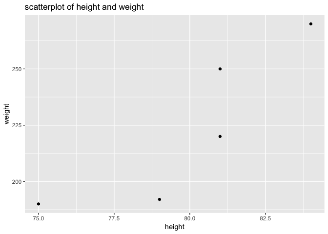

``` r
# Find out how to make another scatterplot of height and weight, using geom_text() to display the names of the players.
ggplot(data = gsw) +
  geom_text(aes(x = height, y = weight, label = player)) + 
  labs(title = "scatterplot of height and weight")
```

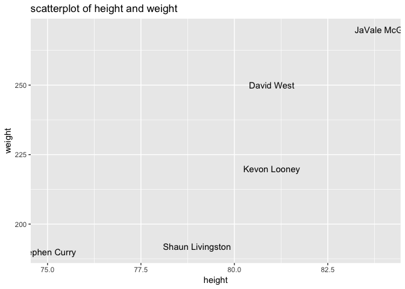

``` r
# Get a scatter plot of height and weight, for ALL the warriors, displaying their names with geom_label().
warriors <- filter(dat, team == 'GSW')
ggplot(data = warriors) + 
  geom_label(aes(x = height, y = weight, label = player)) +
  labs(title = "scatterplot of height and weight, for all the warriors")
```

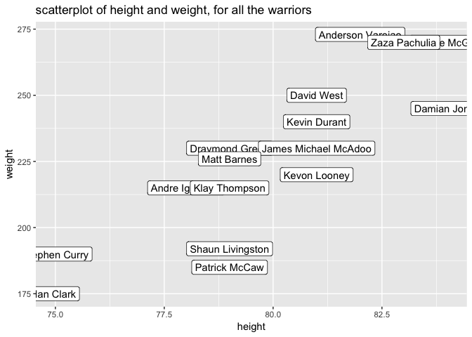

``` r
# Get a density plot of salary (for all NBA players).
ggplot(data = dat, aes(x = salary)) +
  geom_density() +
  labs(title = "density plot of salary")
```

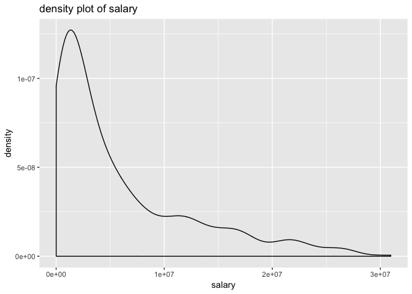

``` r
# Get a histogram of points2 with binwidth of 50 (for all NBA players).
ggplot(data = dat) +
  geom_histogram(aes(x = points2), binwidth = 50) +
  labs(title = "histogram of points2")
```

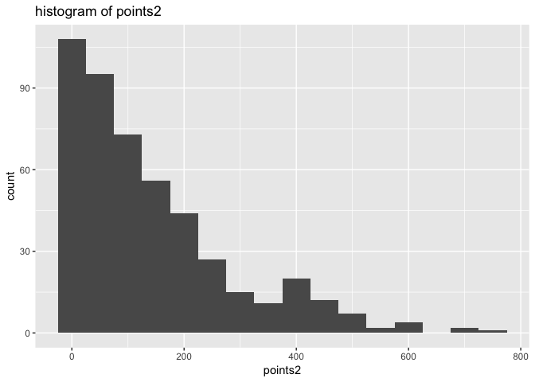

``` r
# Get a barchart of the position frequencies (for all NBA players).
ggplot(data = dat) +
  geom_bar(aes(x = position)) +
  labs(title = "barchart of the position frequencies")
```

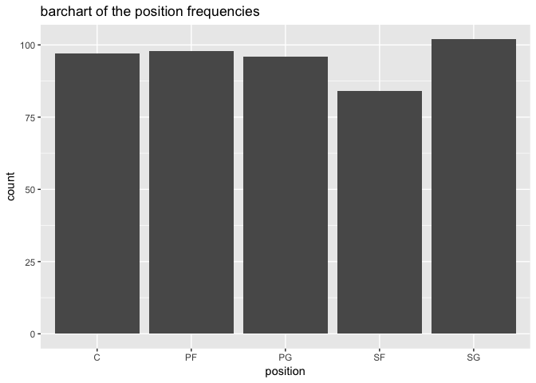

``` r
# Make a scatterplot of experience and salary of all Centers, and use geom_smooth() to add a regression line.
centers <- data.frame(filter(dat, position == 'C'))
ggplot(data = centers) +
  geom_point(aes(x = experience, y = salary)) +
  geom_smooth(aes(x = experience, y = salary), method = lm) +
  labs(title = "scatterplot of experience and salary of all centers")  
```

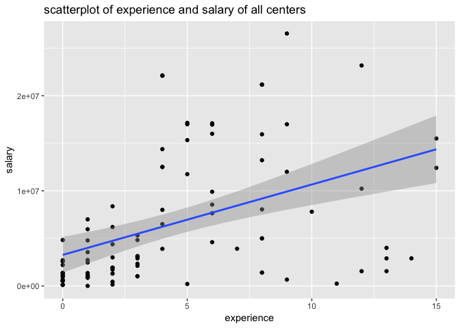

``` r
# Repeat the same scatterplot of experience and salary of all Centers, but now use geom_smooth() to add a loess line (i.e. smooth line).
centers <- data.frame(filter(dat, position == 'C'))
ggplot(data = centers) +
  geom_point(aes(x = experience, y = salary)) +
  geom_smooth(aes(x = experience, y = salary), method = loess) +
  labs(title = "scatterplot of experience and salary of all centers")  
```

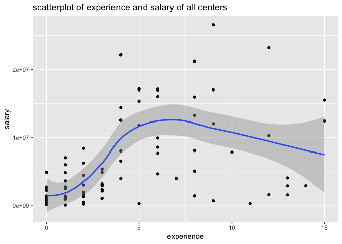

### Faceting

### Your Turn:

``` r
# Make scatterplots of experience and salary faceting by position
ggplot(data = dat, aes(x = experience, y = salary)) +
  geom_point() +
  facet_wrap(~ position) +
  labs(title = "scatterplots of experience and salary")  
```

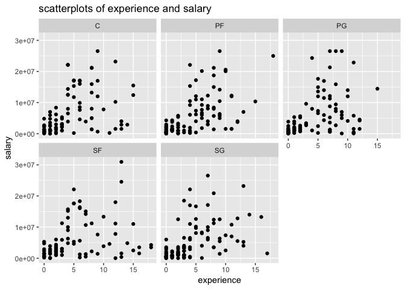

``` r
# Make scatterplots of experience and salary faceting by team
ggplot(data = dat, aes(x = experience, y = salary)) +
  geom_point() +
  facet_wrap(~ team) +
  labs(title = "scatterplots of experience and salary")  
```

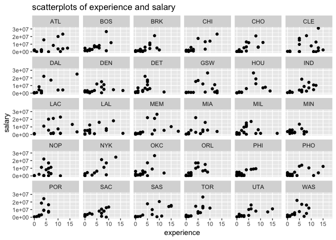

``` r
# Make density plots of age faceting by team
ggplot(data = dat) +
  geom_density(aes(x = age)) + 
  facet_wrap(~ team) +
  labs(title = "density plots of age")  
```

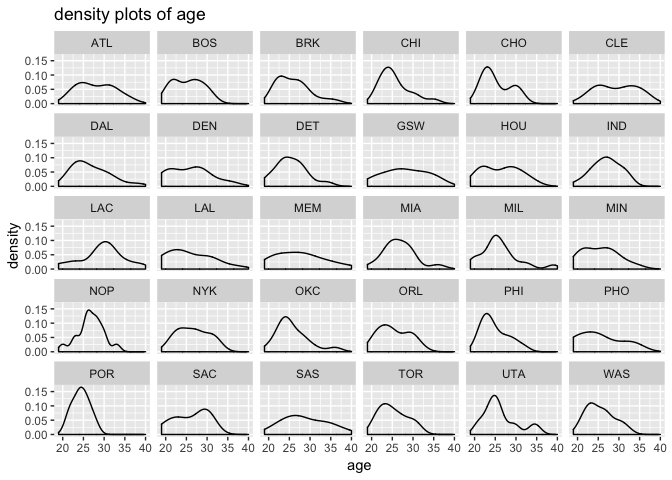

``` r
# Make scatterplots of height and weight faceting by position
ggplot(data = dat, aes(x = height, y = weight)) +
  geom_point() +
  facet_wrap(~ position) +
  labs(title = "scatterplots of height and weight, faceting by position")  
```

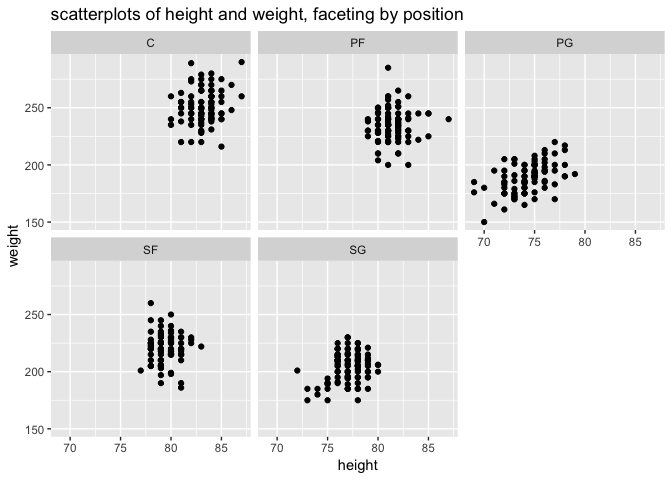

``` r
# Make scatterplots of height and weight, with a 2-dimensional density, geom_density2d(), faceting by position
ggplot(data = dat, aes(x = height, y = weight)) +
  geom_point() +
  geom_density2d() +
  facet_wrap(~ position) +
  labs(title = "scatterplots of height and weight, with a 2-dimensinal density")
```

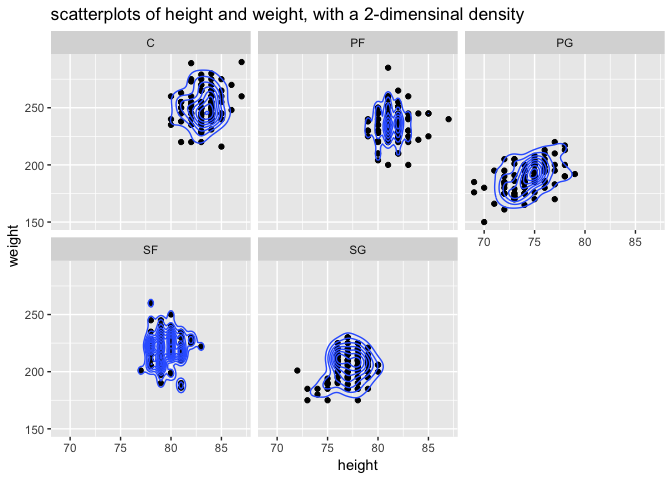

``` r
# Make a scatterplot of experience and salary for the Warriors, but this time add a layer with theme_bw() to get a simpler background
ggplot(data = warriors) +
  geom_point(aes(x = experience, y = salary)) +
  theme_bw() +
  facet_wrap(~ position) +
  labs(title = "scatterplots of experience and salary")
```

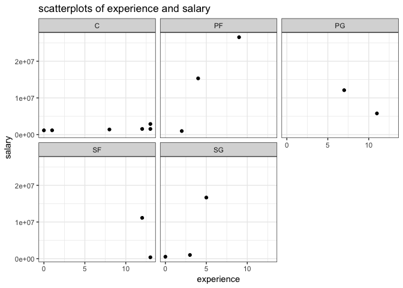

``` r
# Repeat any of the previous plots but now adding a leyer with another theme e.g. theme_minimal(), theme_dark(), theme_classic()
ggplot(data = dat, aes(x = height, y = weight)) +
  geom_point() +
  geom_density2d() +
  theme_dark() +
  facet_wrap(~ position) +
  labs(title = "repeat of a previous plots with another theme added")  
```

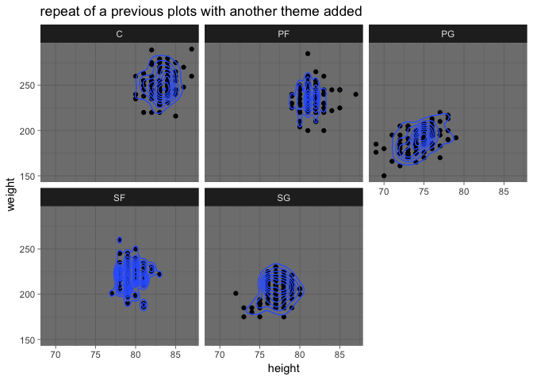
