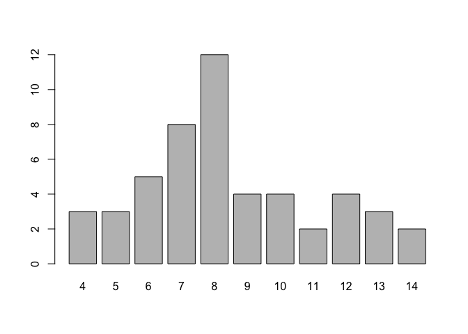

lab09-hongling-lei
================

``` r
library(testthat)
```

    ## Warning: package 'testthat' was built under R version 3.4.4

### Part 2) Basics of String Manipulation\*

``` r
head(USArrests)
```

    ##            Murder Assault UrbanPop Rape
    ## Alabama      13.2     236       58 21.2
    ## Alaska       10.0     263       48 44.5
    ## Arizona       8.1     294       80 31.0
    ## Arkansas      8.8     190       50 19.5
    ## California    9.0     276       91 40.6
    ## Colorado      7.9     204       78 38.7

``` r
states <- rownames(USArrests)
head(states)
```

    ## [1] "Alabama"    "Alaska"     "Arizona"    "Arkansas"   "California"
    ## [6] "Colorado"

``` r
nchar(states)
```

    ##  [1]  7  6  7  8 10  8 11  8  7  7  6  5  8  7  4  6  8  9  5  8 13  8  9
    ## [24] 11  8  7  8  6 13 10 10  8 14 12  4  8  6 12 12 14 12  9  5  4  7  8
    ## [47] 10 13  9  7

``` r
tolower(states)
```

    ##  [1] "alabama"        "alaska"         "arizona"        "arkansas"      
    ##  [5] "california"     "colorado"       "connecticut"    "delaware"      
    ##  [9] "florida"        "georgia"        "hawaii"         "idaho"         
    ## [13] "illinois"       "indiana"        "iowa"           "kansas"        
    ## [17] "kentucky"       "louisiana"      "maine"          "maryland"      
    ## [21] "massachusetts"  "michigan"       "minnesota"      "mississippi"   
    ## [25] "missouri"       "montana"        "nebraska"       "nevada"        
    ## [29] "new hampshire"  "new jersey"     "new mexico"     "new york"      
    ## [33] "north carolina" "north dakota"   "ohio"           "oklahoma"      
    ## [37] "oregon"         "pennsylvania"   "rhode island"   "south carolina"
    ## [41] "south dakota"   "tennessee"      "texas"          "utah"          
    ## [45] "vermont"        "virginia"       "washington"     "west virginia" 
    ## [49] "wisconsin"      "wyoming"

``` r
toupper(states)
```

    ##  [1] "ALABAMA"        "ALASKA"         "ARIZONA"        "ARKANSAS"      
    ##  [5] "CALIFORNIA"     "COLORADO"       "CONNECTICUT"    "DELAWARE"      
    ##  [9] "FLORIDA"        "GEORGIA"        "HAWAII"         "IDAHO"         
    ## [13] "ILLINOIS"       "INDIANA"        "IOWA"           "KANSAS"        
    ## [17] "KENTUCKY"       "LOUISIANA"      "MAINE"          "MARYLAND"      
    ## [21] "MASSACHUSETTS"  "MICHIGAN"       "MINNESOTA"      "MISSISSIPPI"   
    ## [25] "MISSOURI"       "MONTANA"        "NEBRASKA"       "NEVADA"        
    ## [29] "NEW HAMPSHIRE"  "NEW JERSEY"     "NEW MEXICO"     "NEW YORK"      
    ## [33] "NORTH CAROLINA" "NORTH DAKOTA"   "OHIO"           "OKLAHOMA"      
    ## [37] "OREGON"         "PENNSYLVANIA"   "RHODE ISLAND"   "SOUTH CAROLINA"
    ## [41] "SOUTH DAKOTA"   "TENNESSEE"      "TEXAS"          "UTAH"          
    ## [45] "VERMONT"        "VIRGINIA"       "WASHINGTON"     "WEST VIRGINIA" 
    ## [49] "WISCONSIN"      "WYOMING"

``` r
casefold(states)
```

    ##  [1] "alabama"        "alaska"         "arizona"        "arkansas"      
    ##  [5] "california"     "colorado"       "connecticut"    "delaware"      
    ##  [9] "florida"        "georgia"        "hawaii"         "idaho"         
    ## [13] "illinois"       "indiana"        "iowa"           "kansas"        
    ## [17] "kentucky"       "louisiana"      "maine"          "maryland"      
    ## [21] "massachusetts"  "michigan"       "minnesota"      "mississippi"   
    ## [25] "missouri"       "montana"        "nebraska"       "nevada"        
    ## [29] "new hampshire"  "new jersey"     "new mexico"     "new york"      
    ## [33] "north carolina" "north dakota"   "ohio"           "oklahoma"      
    ## [37] "oregon"         "pennsylvania"   "rhode island"   "south carolina"
    ## [41] "south dakota"   "tennessee"      "texas"          "utah"          
    ## [45] "vermont"        "virginia"       "washington"     "west virginia" 
    ## [49] "wisconsin"      "wyoming"

``` r
num_chars <- nchar(states)
char_freqs <- table(num_chars)
barplot(char_freqs)
```



``` r
paste('Pumpkin', 'Pie')
```

    ## [1] "Pumpkin Pie"

``` r
paste('a', 'b', 'c', 'd', 'e')
```

    ## [1] "a b c d e"

``` r
paste('a', 'b', 'c', 'd', 'e', sep = '-')
```

    ## [1] "a-b-c-d-e"

``` r
paste('a', 1:5, sep = '.')
```

    ## [1] "a.1" "a.2" "a.3" "a.4" "a.5"

``` r
# paste0() -vs- paste(..., sep = "")
paste0('Pumpkin', 'Pie')
```

    ## [1] "PumpkinPie"

``` r
paste('Pumpkin', 'Pie', sep = '')
```

    ## [1] "PumpkinPie"

``` r
# paste0() is also vectorized
paste0('a', 1:5)
```

    ## [1] "a1" "a2" "a3" "a4" "a5"

### Your Turn\*: paste()

``` r
first_5 <- head(states, 5)
paste(first_5, nchar(first_5), sep = " = ")
```

    ## [1] "Alabama = 7"     "Alaska = 6"      "Arizona = 7"     "Arkansas = 8"   
    ## [5] "California = 10"

``` r
paste(first_5, collapse = "")
```

    ## [1] "AlabamaAlaskaArizonaArkansasCalifornia"

### Your Turn\*: Permutations

Find the number of permutations that can be formed by using all the given letters in ALABAMA. For instance: "ALAMABA", "AMALABA", "AAAABML".

``` r
table(strsplit("ALABAMA", split = ""))
```

    ## 
    ## A B L M 
    ## 4 1 1 1

``` r
# There are 4A, 1B, 1L, 1M in "ALABAMA"
# First we have 4 As: _A_A_A_A_
# Then insert B: C51 =  5, e.g. _A_B_A_A_A_
# Then insert L: C61 = 6, e.g. _A_B_A_L_A_A_
# Finally inset M: C71 = 7, e.g. _A_B_A_L_A_A_M_ => ABALAAM
# So the total number of permutations is 5 x 6 x 7 = 210
```

∴ Number of permutations = 210

### Substring

``` r
# extract first 3 characters
substr('Berkeley', 1, 3)
```

    ## [1] "Ber"

``` r
# Use substr() to shorten the state names using the first 3-letters:
substr(states, 1, 3)
```

    ##  [1] "Ala" "Ala" "Ari" "Ark" "Cal" "Col" "Con" "Del" "Flo" "Geo" "Haw"
    ## [12] "Ida" "Ill" "Ind" "Iow" "Kan" "Ken" "Lou" "Mai" "Mar" "Mas" "Mic"
    ## [23] "Min" "Mis" "Mis" "Mon" "Neb" "Nev" "New" "New" "New" "New" "Nor"
    ## [34] "Nor" "Ohi" "Okl" "Ore" "Pen" "Rho" "Sou" "Sou" "Ten" "Tex" "Uta"
    ## [45] "Ver" "Vir" "Was" "Wes" "Wis" "Wyo"

``` r
# Use substr() to shorten the state names using the last 3-letters:
substr(states, nchar(states)-2, nchar(states))
```

    ##  [1] "ama" "ska" "ona" "sas" "nia" "ado" "cut" "are" "ida" "gia" "aii"
    ## [12] "aho" "ois" "ana" "owa" "sas" "cky" "ana" "ine" "and" "tts" "gan"
    ## [23] "ota" "ppi" "uri" "ana" "ska" "ada" "ire" "sey" "ico" "ork" "ina"
    ## [34] "ota" "hio" "oma" "gon" "nia" "and" "ina" "ota" "see" "xas" "tah"
    ## [45] "ont" "nia" "ton" "nia" "sin" "ing"

``` r
# How would you shorten the state names using the first letter and the last 3-letters? For instance: "Aama" "Aska" "Aona" "Asas" etc.
paste0(substr(states, 1, 1), substr(states, nchar(states)-2, nchar(states)))
```

    ##  [1] "Aama" "Aska" "Aona" "Asas" "Cnia" "Cado" "Ccut" "Dare" "Fida" "Ggia"
    ## [11] "Haii" "Iaho" "Iois" "Iana" "Iowa" "Ksas" "Kcky" "Lana" "Mine" "Mand"
    ## [21] "Mtts" "Mgan" "Mota" "Mppi" "Muri" "Mana" "Nska" "Nada" "Nire" "Nsey"
    ## [31] "Nico" "Nork" "Nina" "Nota" "Ohio" "Ooma" "Ogon" "Pnia" "Rand" "Sina"
    ## [41] "Sota" "Tsee" "Txas" "Utah" "Vont" "Vnia" "Wton" "Wnia" "Wsin" "Wing"

### Your Turn\*: Converting Temperatures

``` r
to_celsius <- function(x = 1) {
  (x - 32) * (5/9)
}

to_kelvin <- function(x = 1) {
  (x + 459.67) * (5/9)
}

to_reaumur <- function(x = 1) {
  (x - 32) * (4/9)
}

to_rankine <- function(x = 1) {
  x + 459.67
}

temp_convert <- function(x = 1, to = "celsius") {
  switch(to,
         "celsius" = to_celsius(x),
         "kelvin" = to_kelvin(x),
         "reaumur" = to_reaumur(x),
         "rankine" = to_rankine(x))
}

temp_convert(30, 'celsius')
```

    ## [1] -1.111111

``` r
# Rewrite temp_convert() such that the argument to can be given in upper or lower case letters. For instance, the following three calls should be equivalent:

temp_convert <- function(x = 1, to = "celsius") {
  if (tolower(to) == "celsius"){
    to = "celsius"
  }
  if (tolower(to) == "kelvin"){
    to = "kelvin"
  }
  if (tolower(to) == "reaumur"){
    to = "reaumur"
  }
  if (tolower(to) == "rankine"){
    to = "rankine"
  }
  switch(to,
         "celsius" = to_celsius(x),
         "kelvin" = to_kelvin(x),
         "reaumur" = to_reaumur(x),
         "rankine" = to_rankine(x))
}

# test:
temp_convert(30, 'celsius')
```

    ## [1] -1.111111

``` r
temp_convert(30, 'Celsius')
```

    ## [1] -1.111111

``` r
temp_convert(30, 'CELSIUS')
```

    ## [1] -1.111111

### Your Turn\*: Names of files

``` r
# Imagine that you need to generate the names of 10 data .csv files. All the files have the same prefix name but each of them has a different number: file1.csv, file2.csv, … , file10.csv.

# How can you generate a character vector with these names in R? Come up with at least three different ways to get such a vector:

# way1
A1 = paste("file", 1:10, sep = ".")
A1
```

    ##  [1] "file.1"  "file.2"  "file.3"  "file.4"  "file.5"  "file.6"  "file.7" 
    ##  [8] "file.8"  "file.9"  "file.10"

``` r
# way2
A2 = paste0("file.", 1:10)
A2
```

    ##  [1] "file.1"  "file.2"  "file.3"  "file.4"  "file.5"  "file.6"  "file.7" 
    ##  [8] "file.8"  "file.9"  "file.10"

``` r
# way3
X = rep("file", 10)
Y = c(1:10)
A3 = paste(X, Y, sep = ".")
A3
```

    ##  [1] "file.1"  "file.2"  "file.3"  "file.4"  "file.5"  "file.6"  "file.7" 
    ##  [8] "file.8"  "file.9"  "file.10"

``` r
# way4
A4 = rep("file.1", 10)
for (i in 1:10){
  A4[i] = paste0("file.", i)
}
A4
```

    ##  [1] "file.1"  "file.2"  "file.3"  "file.4"  "file.5"  "file.6"  "file.7" 
    ##  [8] "file.8"  "file.9"  "file.10"

``` r
# Now imagine that you need to rename the characters file into dataset. In other words, you want the vector of file names to look like this: dataset1.csv, dataset2.csv, … , dataset10.csv. Take the previous vector of file names and rename its elements:
for (i in 1:10){
  A4[i] = paste0("dataset", i, ".csv")
}
A4
```

    ##  [1] "dataset1.csv"  "dataset2.csv"  "dataset3.csv"  "dataset4.csv" 
    ##  [5] "dataset5.csv"  "dataset6.csv"  "dataset7.csv"  "dataset8.csv" 
    ##  [9] "dataset9.csv"  "dataset10.csv"

### Your turn\*: cat()

``` r
# modify

# name of output file
outfile <- "output.txt"

# writing to 'outfile.txt'
cat("---", file = outfile)
# insert new lines
cat("\n", file = outfile, append = TRUE)
cat('title: "A random .txt file"', file = "output.txt", append = TRUE)

cat("\n", file = outfile, append = TRUE)
cat('author: "Hongling Lei"', file = outfile, append = TRUE)

cat("\n", file = outfile, append = TRUE)
cat('date: "4/4/2019"', file = outfile, append = TRUE)

cat("\n", file = outfile, append = TRUE)
cat('output: "html_document"', file = outfile, append = TRUE)

cat("\n", file = outfile, append = TRUE)
cat("---", file = outfile, append = TRUE)

cat("\n\n", file = outfile, append = TRUE)
cat("This is the first line", file = outfile, append = TRUE)

cat("\n", file = outfile, append = TRUE)
cat("A 2nd line", file = "output.txt", append = TRUE)
# insert 2 new lines
cat("\n\n", file = outfile, append = TRUE)
cat("\nThe quick brown fox jumps over the lazy dog\n", file = outfile, append = TRUE)
```

### Your Turn\*: Valid Color Names

``` r
# my is_color() function:
#' @title is_color function
#' @description tests if a given name-in English-is a valid R color
#' @param color the color you typed in
#' @return TRUE or FALSE

is_color <- function(color){
  return(is.element(color, colors()))
}

# test it:
is_color('yellow')  # TRUE
```

    ## [1] TRUE

``` r
is_color('blu')     # FALSE
```

    ## [1] FALSE

``` r
is_color('turkuoise') # FALSE
```

    ## [1] FALSE
