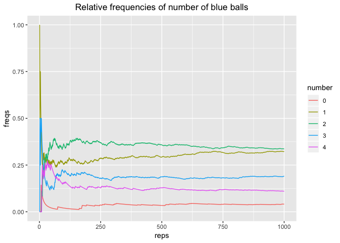

lab10-hongline-lei
================

### Part 1) Computing Probabilities

``` r
# bags
bag1 <- c('white', 'white', 'red')
bag2 <- c(rep('white', 3), 'red')

# To compute the probability using simulations, 
# we need to replicate the random experiments a large number of times (e.g. 500 or 1000 times).
bags <- c('bag1', 'bag2')
repetitions <- 1000
drawn_balls <- character(repetitions)

set.seed(345)
for (i in 1:repetitions) {
  # select one bag
  chosen_bag <- sample(bags, 1)
  
  # draw a ball from chosen bag
  if (chosen_bag == 'bag1') {
    drawn_balls[i] <- sample(bag1, 1)
  } else {
    drawn_balls[i] <- sample(bag2, 1)
  }
}

table(drawn_balls) / repetitions
```

    ## drawn_balls
    ##   red white 
    ## 0.263 0.737

### Your Turn\*

##### 1.

``` r
# Create two character vectors box1 and box2 with colors of balls:
box1 <- c('blue', 'blue', 'red')
box2 <- c('blue', 'blue', 'red', 'red', 'red', 'white')
```

##### 2.

``` r
# The random experiment involves generating a uniform random number using runif(1). 
rd <- runif(1)

# If this number is greater than 0.5, get a sample() with replacement of size = 4 from box1. 
if (rd > 0.5){
  draw_balls <- sample(box1, 4, replace = TRUE)
}
# Otherwise, get a sample() without replacement of size = 4 from box2.
if (rd <= 0.5){
  draw_balls <- sample(box2, 4)
}
```

##### 3.

``` r
# Repeat the experiment 1000 times using a for loop. 
# To store the drawn samples, use a matrix drawn_balls. 
# This matrix will have 1000 rows and 4 columns. 
# In each row you assign the output of a random sample of balls.

boxes <- c('box1', 'box2')
repetitions <- 1000
drawn_balls <- data.frame(matrix(nrow = 1000, ncol = 4))

set.seed(345)
for (i in 1:repetitions) {
  rd = runif(1)
  if (rd > 0.5){
  drawn_balls[i, ] = sample(box1, 4, replace = TRUE)
  } else{
  drawn_balls[i, ] = sample(box2, 4)
  }
}
```

##### 4.

``` r
# Once you filled the matrix drawn_balls, compute the proportion of samples containing: 0, 1, 2, 3, or 4 blue balls.

# first create a column full of 0
num_blue <- data.frame(matrix(0, nrow = 1000, ncol = 1))
# then put the number of "blue"s each row into num_blue
# i.e. num_blue counts the number of "blue" each row
for (i in 1:1000){
  num_blue <- apply(drawn_balls, 1, function(x) sum(x == 'blue'))
}

# or Alternatively, we can use 
# num_blue[i, 1] = sum((drawn_balls[i, ] %in% "blue"), na.rm = TRUE)

sum(num_blue == 0)/1000 # proportion of samples containing 0 blue ball
```

    ## [1] 0.041

``` r
sum(num_blue == 1)/1000
```

    ## [1] 0.323

``` r
sum(num_blue == 2)/1000
```

    ## [1] 0.336

``` r
sum(num_blue == 3)/1000
```

    ## [1] 0.19

``` r
sum(num_blue == 4)/1000
```

    ## [1] 0.11

##### 5.

``` r
# Try to obtain the following plot showing the relative frequencies of number of blue balls over the series of repetitions.
blue_freqs <- vector(mode = "list", length = 5)

for (req_blue in 0:4) {
  temp_freqs <- cumsum(num_blue == req_blue) / (1:repetitions)
  blue_freqs[[req_blue + 1]] <- temp_freqs
}
    
dat <- data.frame(
  reps = rep(1:repetitions, 5),
  freqs = unlist(blue_freqs),
  number = factor(rep(0:4, each = repetitions)))

library(ggplot2)
```

    ## Warning: package 'ggplot2' was built under R version 3.4.4

``` r
ggplot(data = dat, aes(x = reps, y = freqs, group = number)) +
  geom_path(aes(color = number)) +
  ggtitle("Relative frequencies of number of blue balls")+
  theme(plot.title = element_text(hjust = 0.5))
```


