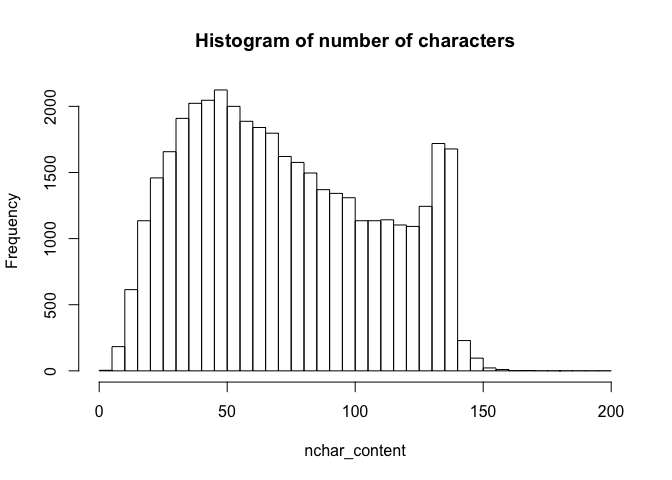
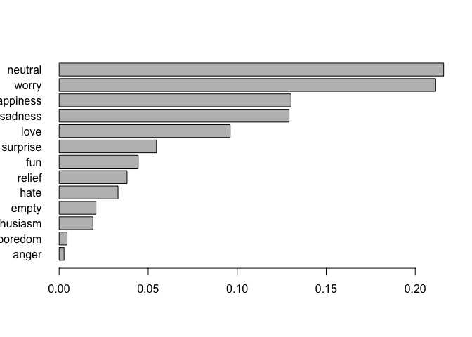

lab11-hongling-lei
================

``` r
library(stringr)
```

    ## Warning: package 'stringr' was built under R version 3.4.4

``` r
library(dplyr)
```

    ## Warning: package 'dplyr' was built under R version 3.4.4

    ## 
    ## Attaching package: 'dplyr'

    ## The following objects are masked from 'package:stats':
    ## 
    ##     filter, lag

    ## The following objects are masked from 'package:base':
    ## 
    ##     intersect, setdiff, setequal, union

``` r
getwd()
```

    ## [1] "/Users/Macbook/Desktop/labs/lab11-regex-basics"

``` r
dat <- read.csv("text-emotion.csv")
```

1) Number of characters per tweet\*
-----------------------------------

``` r
nchar_content <- str_count(dat$content)
summary(nchar_content)
```

    ##    Min. 1st Qu.  Median    Mean 3rd Qu.    Max. 
    ##    1.00   43.00   69.00   73.41  103.00  167.00

``` r
hist(nchar_content, main = "Histogram of number of characters", breaks = seq(0,200,5))
```



``` r
# Are there any tweets with 0 characters?
sum(nchar_content == 0)
```

    ## [1] 0

So there is no tweet with 0 character.

``` r
# Are there any tweets with 1 character? If yes (write commands that answer these questions):
# how many?
sum(nchar_content == 1)
```

    ## [1] 4

``` r
# what is their content?
dat$content[nchar_content == 1]
```

    ## [1] 0 0 0 0
    ## 39827 Levels: - arrggh kids that won't settle....need some Kava for Liam, that'll sort 'em... ...

``` r
# what is their location (i.e. index or position)?
which(nchar_content == 1)
```

    ## [1]   341 15029 29870 39416

``` r
# What is the tweet with the most characters (i.e. max length)? 
# (write a command that answers these questions).
# the number of characters
max(nchar_content)
```

    ## [1] 167

``` r
# display its content
dat$content[nchar_content == max(nchar_content)]
```

    ## [1] &quot;I'll see you again yeah?&quot; &quot;Its up to you&quot; &quot;I guarantee you will, i dont want to wait to long not seeing you&quot; fuckin fruit basket! Hahaha
    ## 39827 Levels: - arrggh kids that won't settle....need some Kava for Liam, that'll sort 'em... ...

``` r
# what is its location (i.e. index or position)?
which(nchar_content == max(nchar_content))
```

    ## [1] 34099

2) Author (usernames)\*
-----------------------

``` r
nchar_user = str_count(dat$author)
# No longer than 15 characters (if you find usernames longer than 15 characters, display them)
sum(nchar_user > 15)
```

    ## [1] 0

``` r
# Contain alphanumeric characters and underscore
sum(str_detect(dat$author, pattern = "\\W"))
```

    ## [1] 1

``` r
# If you find usernames containing other symbols, display them. 
dat$author[str_detect(dat$author, pattern = "\\W")== 1]
```

    ## [1] 4040-10-01
    ## 33871 Levels: _____gizzz ___shannon ___Sunny___ __Anya__ ... zzzValzzz

``` r
# What is the number of characters of the shortest usernames?
min(nchar_user)
```

    ## [1] 2

3) Various Symbols and Strings\*
--------------------------------

``` r
# How many tweets contain at least one caret symbol "^"
sum(str_detect(dat$content, pattern = "[\\^]{1,}")) # {1,} means more than 1
```

    ## [1] 40

``` r
# How many tweets contain three or more consecutive dollar symbols "$"
sum(str_detect(dat$content, pattern = "[\\$]{3,}"))
```

    ## [1] 7

``` r
# How many tweets do NOT contain the characters "a" or "A"
sum(!(str_detect(dat$content, fixed('a',ignore_case = TRUE))))
```

    ## [1] 1875

``` r
# Display the first 10 elements of the tweets that do NOT contain the characters "a" or "A"
head(dat$content[(str_detect(dat$content, fixed('a',ignore_case = TRUE))) == FALSE], 10)
```

    ##  [1] Hmmm. http://www.djhero.com/ is down      
    ##  [2] Got the news                              
    ##  [3] I missed the bl***y bus!!!!!!!!           
    ##  [4] I need skott right now                    
    ##  [5] I miss Voobys!                            
    ##  [6] i'm so tired                              
    ##  [7] miss 16'th                                
    ##  [8] my sole supporter is not my sole supporter
    ##  [9] @Emilyyy16 urgh stop it guys              
    ## [10] I miss my puppy                           
    ## 39827 Levels: - arrggh kids that won't settle....need some Kava for Liam, that'll sort 'em... ...

``` r
# compute a vector with the number of exclamation symbols in each tweet, and display its summary().
num_exc <- str_count(dat$content, pattern = "[\\!]")
summary(num_exc)
```

    ##    Min. 1st Qu.  Median    Mean 3rd Qu.    Max. 
    ##  0.0000  0.0000  0.0000  0.5504  1.0000 76.0000

``` r
# What’s the tweet (content) with the largest number of exclamation symbols !? Display its content.
dat$content[num_exc == max(num_exc)]
```

    ## [1] WHAHHH!!!!!!!!!!!!!!!!!!!!!!!!!!!!!!!!!!!! NOO!!!!!!!!!!!!!!!!!!!!!!!!!!!!!!!!!!!!!!!!
    ## 39827 Levels: - arrggh kids that won't settle....need some Kava for Liam, that'll sort 'em... ...

4) Sentiment\*
--------------

``` r
# What are the different types of sentiments (i.e. categories)?
# compute the frequencies
sent <- table(dat$sentiment)/40000
sent
```

    ## 
    ##      anger    boredom      empty enthusiasm        fun  happiness 
    ##   0.002750   0.004475   0.020675   0.018975   0.044400   0.130225 
    ##       hate       love    neutral     relief    sadness   surprise 
    ##   0.033075   0.096050   0.215950   0.038150   0.129125   0.054675 
    ##      worry 
    ##   0.211475

``` r
# Graph the relative frequencies (i.e. proportions) with a horizontal barplot in decreasing order
barplot(sort(sent, decreasing = FALSE), horiz = TRUE, las = 1) # las = 1 means let the name of each sentiment be horizontal
```



``` r
# compute a table with the average length of characters per sentiment 
dat2 <- mutate(dat, length = str_count(dat$content))
summarise(group_by(dat2, sentiment), 
          avg = mean(length))
```

    ## # A tibble: 13 x 2
    ##    sentiment    avg
    ##    <fct>      <dbl>
    ##  1 anger       77.7
    ##  2 boredom     74.2
    ##  3 empty       64.6
    ##  4 enthusiasm  74.8
    ##  5 fun         81.3
    ##  6 happiness   75.6
    ##  7 hate        78.5
    ##  8 love        74.5
    ##  9 neutral     64.5
    ## 10 relief      76.5
    ## 11 sadness     75.0
    ## 12 surprise    75.7
    ## 13 worry       76.7
