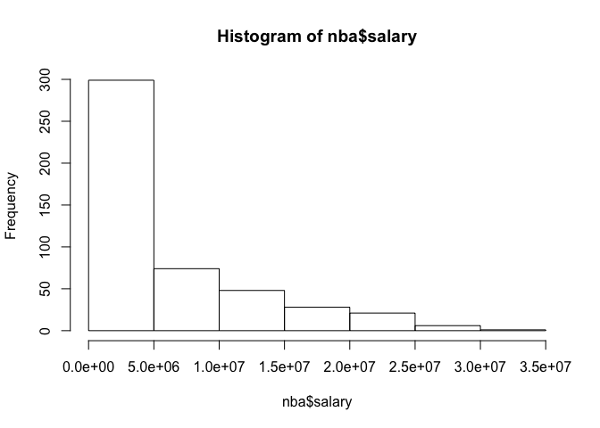
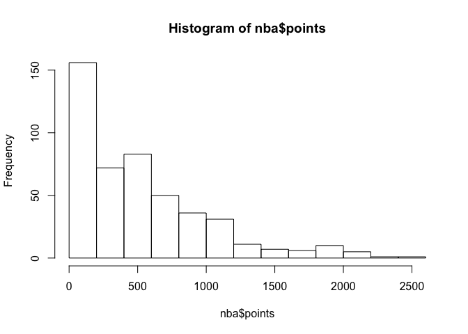
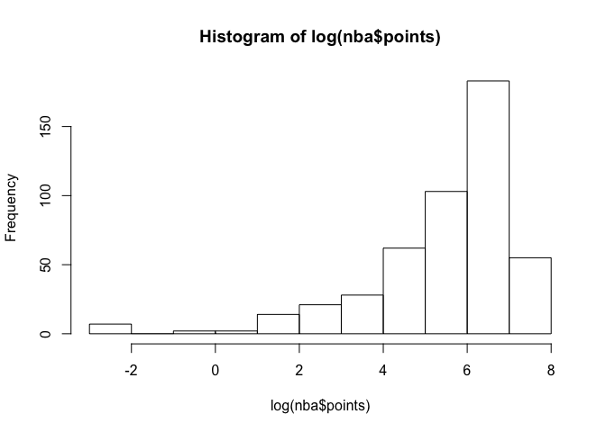
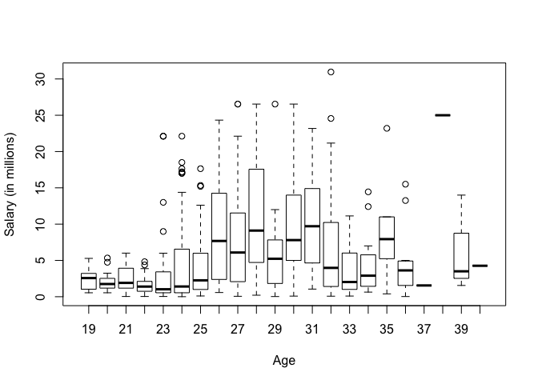
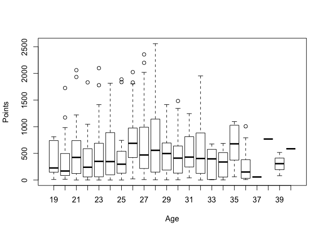
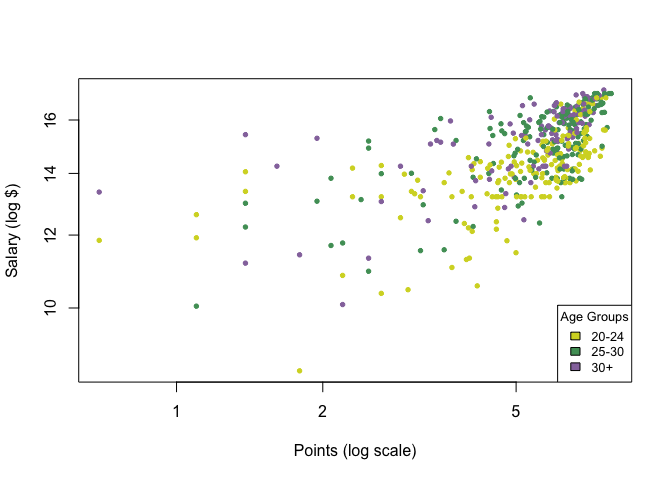
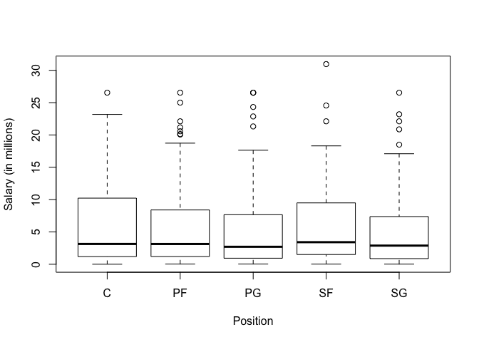
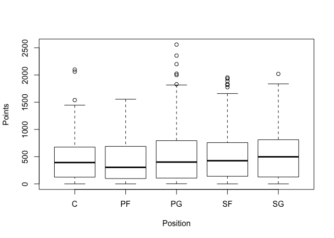
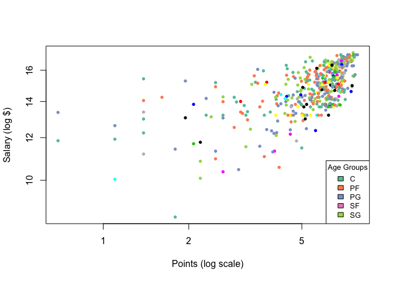

warmup03-hongling-lei
================

### 1) Importing Data

``` r
# Do the data have a header containing the variable names?
```

Yes, the data have a header containing the variable names.

``` r
# Are the values for an observation separated by a comma, blank, or tab?
```

They're separated by a comma.

``` r
# Are there any missing vales? If so, how are they codified?
```

Yes, there are missing values. They're codified as " " (space).

``` r
player_data = 'https://raw.githubusercontent.com/ucb-stat133/stat133-hws/master/data/nba2018-players.csv'
player_table = read.table(player_data, sep = ",")
player_csv = read.csv(player_data)
```

In read.table(), the default setting is "header = FALSE" and "sep = ''".
In read.csv(), the default setting is "header = TRUE" and "sep = ','".

``` r
# assembling url so it fits on the screen
github <- 'https://raw.githubusercontent.com/ucb-stat133/stat133-hws/'
repo <- 'master/data/nba2018-players.csv'
datafile <- paste0(github, repo)
```

### a)

``` r
data_types <- c("character", "factor", "factor", "integer", "integer", "integer", "integer", "character", "double", "integer", "integer", "integer", "integer", "integer", "integer")
```

### b)

``` r
nba <- read.csv(datafile, colClasses = data_types)
str(nba, vec.len = 1)
```

    ## 'data.frame':    477 obs. of  15 variables:
    ##  $ player    : chr  "Al Horford" ...
    ##  $ team      : Factor w/ 30 levels "ATL","BOS","BRK",..: 2 2 ...
    ##  $ position  : Factor w/ 5 levels "C","PF","PG",..: 1 2 ...
    ##  $ height    : int  82 81 ...
    ##  $ weight    : int  245 240 ...
    ##  $ age       : int  30 29 ...
    ##  $ experience: int  9 11 ...
    ##  $ college   : chr  "University of Florida" ...
    ##  $ salary    : num  26540100 ...
    ##  $ games     : int  68 80 ...
    ##  $ minutes   : int  2193 1608 ...
    ##  $ points    : int  952 520 ...
    ##  $ points3   : int  86 27 ...
    ##  $ points2   : int  293 186 ...
    ##  $ points1   : int  108 67 ...

### c)

``` r
nba2 <- read.table(datafile, colClasses = data_types, header = TRUE, sep = ",")
str(nba2, vec.len = 1)
```

    ## 'data.frame':    477 obs. of  15 variables:
    ##  $ player    : chr  "Al Horford" ...
    ##  $ team      : Factor w/ 30 levels "ATL","BOS","BRK",..: 2 2 ...
    ##  $ position  : Factor w/ 5 levels "C","PF","PG",..: 1 2 ...
    ##  $ height    : int  82 81 ...
    ##  $ weight    : int  245 240 ...
    ##  $ age       : int  30 29 ...
    ##  $ experience: int  9 11 ...
    ##  $ college   : chr  "University of Florida" ...
    ##  $ salary    : num  26540100 ...
    ##  $ games     : int  68 80 ...
    ##  $ minutes   : int  2193 1608 ...
    ##  $ points    : int  952 520 ...
    ##  $ points3   : int  86 27 ...
    ##  $ points2   : int  293 186 ...
    ##  $ points1   : int  108 67 ...

### d)

``` r
identical(nba, nba2)
```

    ## [1] TRUE

### 2) Technical Questions about importing data

### a)

``` r
# What happens to the column names of the imported data when you invoke read.csv(datafile, header = FALSE, nrows = 10)?
```

The column names will not be displayed, rather they'll just be the default versions like "V1", "V2", etc. And the real column names like "player", "team", "position", etc. will be treated as the first row of data, rather than the names of data.

### b)

``` r
# What happens to the data types of the columns when you invoke read.csv(datafile, header = FALSE, nrows = 10)?
```

The data types of all the columns will be "factors".

### c)

``` r
# Why does the command read.table(datafile, nrows = 10) fail to import the data?
```

Because you did not specify *sep = ","*. Without this information, R will suppose it comply with the default setting, i.e. sep = "", while it is not the case (sep = ",") here.

### d)

``` r
# Say you import nba2018-players.csv in two different ways. In the first option you import the data without specifying the data type of each column. In the second option you do specify the data types as in data_types. You may wonder whether both options return a data frame of the same memory size. You can actually use the function object.size() that provides an estimate of the memory that is being used to store an R object. What data importing function returns the smallest data frame (in terms of memory size)?
nba3 <- read.table(datafile, header = TRUE, sep = ",")
object.size(nba3)
```

    ## 78992 bytes

``` r
nba2 <- read.table(datafile, colClasses = data_types, header = TRUE, sep = ",")
object.size(nba2)
```

    ## 77200 bytes

The data importing function where we specify data types returns the smallest data frame.

### e)

``` r
# Say the object nba is the data frame produced when importing nba2018-players.csv. If you invoke as.matrix(nba), what happens to the data values of this matrix?
```

The values are unchanged, but the data types are all changed.
Originally in the data.frame, the data have different types such as characters, integers, etc.
However, in the matrix, all the data are changed to "character" type.

### 3) Examine Salary

### a)

``` r
summary(nba$salary)
```

    ##     Min.  1st Qu.   Median     Mean  3rd Qu.     Max. 
    ##     5145  1050961  3000000  5804697  8269663 30963450

### b)

``` r
hist(nba$salary)
```



### c)

``` r
salary2 <- nba$salary / 1000000
hist(salary2)
```


### d)

``` r
logsalary2 <- log(salary2)
hist(logsalary2)
```


Comments:
The log function has only positive independent variables but both positive and negative dependent variables.
When an indepedent variable (salary in million dollars) have a value less than *e* (around 2.718), its corresponding log value (which is nba$logsalary in the graph) will be negative.
Similarly, when an indepedent variable (salary in million dollars) have a value greater than *e* (around 2.718), its corresponding log value will be positive.

### e)

``` r
low <- !as.logical(salary2)
temp <- which(log(salary2) < -3)
low[temp] <- TRUE 
table(low)
```

    ## low
    ## FALSE  TRUE 
    ##   469     8

8 people have what we call a low salary.

### f)

``` r
name <- nba$player[low == TRUE]
weight <- nba$weight[low == TRUE]
height <- nba$height[low == TRUE]
team <- nba$team[low == TRUE]
position <- nba$position[low == TRUE]
data.frame(name, weight, height, team, position)
```

    ##                  name weight height team position
    ## 1       Dahntay Jones    225     78  CLE       SF
    ## 2         Edy Tavares    260     87  CLE        C
    ## 3         Gary Payton    190     75  MIL       PG
    ## 4 Marcus Georges-Hunt    216     77  ORL       SG
    ## 5     Patricio Garino    210     78  ORL       SG
    ## 6      Alex Poythress    238     79  PHI       PF
    ## 7          Ben Bentil    235     81  DAL       PF
    ## 8      Elijah Millsap    225     78  PHO       SG

### g)

``` r
nba <- nba[!(low == TRUE), ]
dim(nba)
```

    ## [1] 469  15

### 4) Explore Points

### a)

``` r
summary(nba$points)
```

    ##    Min. 1st Qu.  Median    Mean 3rd Qu.    Max. 
    ##     0.0   132.0   414.0   518.8   759.0  2558.0

``` r
hist(nba$points)
```



### b)

``` r
nba <- read.csv(datafile, colClasses = data_types, header = TRUE)
# to replace those whose points are 0 with 0.1
nba$points[which(nba$points == 0)] <- nba$points[which(nba$points == 0)] + 0.1
hist(log(nba$points))
```



Comments: The histogram is obviously skewed to the right. Those with a point over e (which is around 2.718) will be located right of 0 in the graph. Otherwise it would be negative. Looking at the points data, most players scored points over 2.718, which complies with the graphing results. Also we can see that most logs fall between 6 and 7, which is somewhere near the mean and median.

### 5) Transforming Age into a Factor

### a)

``` r
boxplot(salary2~age, data = nba, xlab = "Age", ylab = "Salary (in millions)")
```



Comments: Yes, there seems to be a difference between salaries depending on the age of the player. The thick black lines represent the medians, and those differ a lot. Also we can see the variances of salaries also differ among age groups. In general, players aged between 26 to 31 earn the highest on average, but they also have the most outliers.

### b)

``` r
boxplot(points~age, data = nba, xlab = "Age", ylab = "Points")
```



Comments: No, there seems to be little difference between points on the age of the player. The thick black lines represent the medians, and they almost remain on the same level. However, looking at the highest points in every age group, we can find that players aged between 20 and 28 are more likeley to score a super impressive point than other groups (either too young or too old).

### c)

``` r
age2 <- nba$age
age2[which(age2 <= 19)] <- 20
age2 <- as.numeric(age2)
age2 <- cut(age2, breaks = c(20, 25, 30, max(age2)+1), right = FALSE, label = c('20-24', '25-30', '30+'))
summary(age2)
```

    ## 20-24 25-30   30+ 
    ##   186   176   115

### 6）Plotting Salary against Points, by Age Group

``` r
salary = log(nba$salary)
points = log(nba$points)
```

### a)

``` r
# Begin by making a vector of three colors. Use the colors called "#D4D62A", "#4F9D66", and "#9575AB", in that order. Call this vector, palette1.
palette1 <- c("#D4D62A", "#4F9D66", "#9575AB")
```

### b)

``` r
# Next, make a vector of colors that matches the length of age2, and where a value is "20-24", the color is #D4D62A; where a value is “25-29”, the color is #4F9D66, etc. Use subsetting by position of the vector palette1 to do this. Call this new vector, age_colors.
nba$color <- as.character(nba$age)
nba$color[nba$age < 25] <- "#D4D62A"
nba$color[nba$age < 30 & nba$age >= 25] <- "#4F9D66"
nba$color[nba$age >= 30] <- "#9575AB"
age_colors <- nba$color
levels(age2)
```

    ## [1] "20-24" "25-30" "30+"

### c)

``` r
# Lastly, make the scatterplot as follows
plot(log(salary) ~ log(points), data = nba, log = "xy", main = "", xlab = "Points (log scale)", ylab = "Salary (log $)", col = age_colors, pch = 19, cex = 0.6)
```

    ## Warning in xy.coords(x, y, xlabel, ylabel, log): 9 x values <= 0 omitted
    ## from logarithmic plot

``` r
legend("bottomright", fill = palette1, legend = levels(age2), title = "Age Groups", cex = 0.8)
```



### 7) Plotting Salary Against Points, by Position

### a)

``` r
# Begin by making a conditional boxplot of salary2 by position. Compare the boxplots by age, and comment on whether there seems to be a difference in salaries depending on the position of the players.
boxplot(salary2~nba$position, data = nba, xlab = "Position", ylab = "Salary (in millions)")
```



Comments: There seems not to be a difference in salaries depending on the position of the player, because the thick black line represents the medium and they're almost at the same level, and the boxes are of similar sizes. The farthest outliers are also around the same level.
However, we should notice that for "C" position, the first quartile is obviously higher than those of the other three, which is straightforward because "central" is a very important position.

### b)

``` r
# Repeat the same type of boxplot, but this time using points instead of salary2. Compare the boxplots by position, and comment on whether there seems to be a difference in scored points depending on the position of the players.
boxplot(nba$points~nba$position, data = nba, xlab = "Position", ylab = "Points")
```



Comments: There are some slight differences between points scored depending on the position of the players. In general the box sizes are similar and the mediums are of similar level, but PG is the most volatile position because it has the farthest and the most outliers. It also has the highest first quartile.

### c)

``` r
# Follow the approach in the previous section (6) to create a new variable called pos_colors with colors for positions:#66c2a5"
palette2 <- c("#66c2a5", "#fc8d62", "#8da0cb", "#e78ac3", "#a6d854")
nba$color2 <- as.character(nba$age)
nba$color2[nba$position == 'C'] <- "#66c2a5"
nba$color2[nba$position == 'PF'] <- "#fc8d62"
nba$color2[nba$position == 'PG'] <- "#8da0cb"
nba$color2[nba$position == 'SF'] <- "#e78ac3"
nba$color2[nba$position == 'SF'] <- "#a6d854"
pos_colors <- nba$color2
```

### d)

``` r
# Make a plot of salary against points (determine if they should be on the log scale) and color the plotting symbols according to position. Don’t forget to add a legend.
age2 <- as.factor(age2)
plot(log(nba$salary) ~ log(nba$points), data = nba, log = "xy", main = "", xlab = "Points (log scale)", ylab = "Salary (log $)", col = pos_colors, pch = 19, cex = 0.6)
```

    ## Warning in xy.coords(x, y, xlabel, ylabel, log): 9 x values <= 0 omitted
    ## from logarithmic plot

``` r
legend("bottomright", fill = palette2, legend = levels(position), title = "Age Groups", cex = 0.8)
```



Yes, I think they should be on the log scale.
