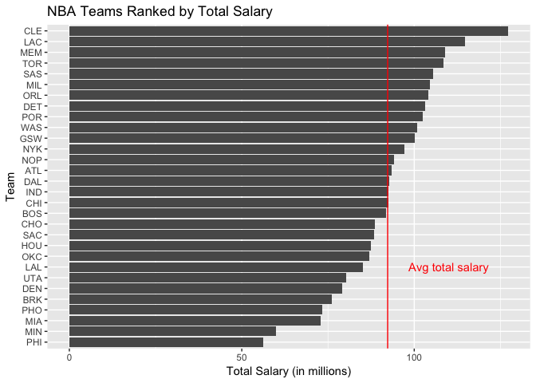
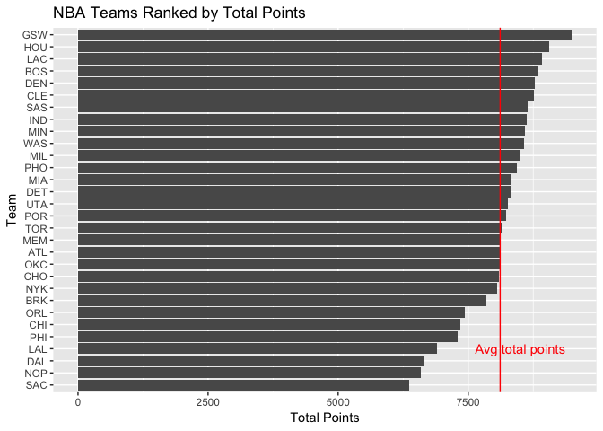
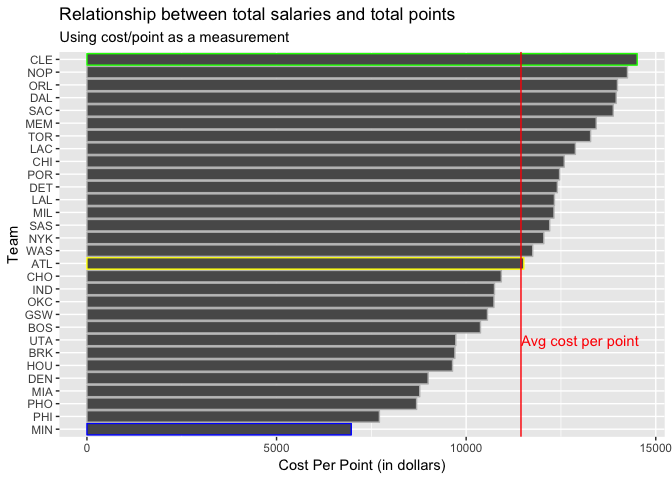
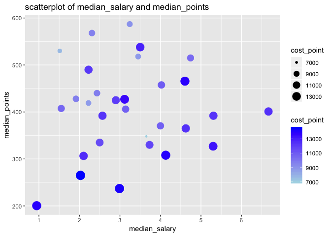

warmup04-hongling-lei
================

1) Importing Data
=================

``` r
datafile <- 'https://github.com/ucb-stat133/stat133-hws/raw/master/data/nba2018-players.csv'
download.file(url = datafile, "datafile.csv")
```

The data has a header for column names. "" is used to encode missing values. The data types of each column is listed as below.

``` r
str(datafile)
```

    ##  chr "https://github.com/ucb-stat133/stat133-hws/raw/master/data/nba2018-players.csv"

``` r
library(readr)
```

    ## Warning: package 'readr' was built under R version 3.4.4

``` r
column_types <- "ccfiiiicdiiiiii"
dat <- read_csv("datafile.csv", col_types = column_types)
dat
```

    ## # A tibble: 477 x 15
    ##    player team  position height weight   age experience college salary
    ##    <chr>  <chr> <fct>     <int>  <int> <int>      <int> <chr>    <dbl>
    ##  1 Al Ho… BOS   C            82    245    30          9 Univer… 2.65e7
    ##  2 Amir … BOS   PF           81    240    29         11 <NA>    1.20e7
    ##  3 Avery… BOS   SG           74    180    26          6 Univer… 8.27e6
    ##  4 Demet… BOS   PG           73    201    22          0 Univer… 1.45e6
    ##  5 Geral… BOS   SF           79    205    31          9 <NA>    1.41e6
    ##  6 Isaia… BOS   PG           69    185    27          5 Univer… 6.59e6
    ##  7 Jae C… BOS   SF           78    235    26          4 Marque… 6.29e6
    ##  8 James… BOS   SG           78    215    21          2 Univer… 1.83e6
    ##  9 Jayle… BOS   SF           79    225    20          0 Univer… 4.74e6
    ## 10 Jonas… BOS   PF           82    231    29          6 <NA>    5.00e6
    ## # … with 467 more rows, and 6 more variables: games <int>, minutes <int>,
    ## #   points <int>, points3 <int>, points2 <int>, points1 <int>

``` r
summary(dat)
```

    ##     player              team           position     height     
    ##  Length:477         Length:477         C : 97   Min.   :69.00  
    ##  Class :character   Class :character   PF: 98   1st Qu.:77.00  
    ##  Mode  :character   Mode  :character   SG:102   Median :79.00  
    ##                                        PG: 96   Mean   :79.09  
    ##                                        SF: 84   3rd Qu.:82.00  
    ##                                                 Max.   :87.00  
    ##      weight           age          experience       college         
    ##  Min.   :150.0   Min.   :19.00   Min.   : 0.000   Length:477        
    ##  1st Qu.:200.0   1st Qu.:23.00   1st Qu.: 1.000   Class :character  
    ##  Median :220.0   Median :26.00   Median : 4.000   Mode  :character  
    ##  Mean   :219.9   Mean   :26.39   Mean   : 4.662                     
    ##  3rd Qu.:240.0   3rd Qu.:29.00   3rd Qu.: 7.000                     
    ##  Max.   :290.0   Max.   :40.00   Max.   :18.000                     
    ##      salary             games          minutes         points      
    ##  Min.   :    5145   Min.   : 1.00   Min.   :   1   Min.   :   0.0  
    ##  1st Qu.: 1050961   1st Qu.:25.00   1st Qu.: 381   1st Qu.: 124.0  
    ##  Median : 3000000   Median :60.00   Median :1123   Median : 403.0  
    ##  Mean   : 5804697   Mean   :50.71   Mean   :1164   Mean   : 510.3  
    ##  3rd Qu.: 8269663   3rd Qu.:74.00   3rd Qu.:1843   3rd Qu.: 756.0  
    ##  Max.   :30963450   Max.   :82.00   Max.   :3048   Max.   :2558.0  
    ##     points3         points2         points1      
    ##  Min.   :  0.0   Min.   :  0.0   Min.   :  0.00  
    ##  1st Qu.:  2.0   1st Qu.: 30.0   1st Qu.: 15.00  
    ##  Median : 26.0   Median :100.0   Median : 50.00  
    ##  Mean   : 46.4   Mean   :142.3   Mean   : 86.49  
    ##  3rd Qu.: 73.0   3rd Qu.:208.0   3rd Qu.:116.00  
    ##  Max.   :324.0   Max.   :730.0   Max.   :746.00

``` r
class(dat)
```

    ## [1] "spec_tbl_df" "tbl_df"      "tbl"         "data.frame"

2) Technical Questions about "readr"
====================================

### a)

``` r
# When you print dat—typing the name of the object to see how it gets displayed—R tells you that it is a tibble. Do some research (e.g. google it) to explain what are the similarities and differences between a data.frame and a tibble.
```

**Similarities:**
Tibbles are a modern take on data frames. They keep the features that have stood the test of time, and drop the features that used to be convenient but are now frustrating (i.e. converting character vectors to factors).
(source: <https://cran.r-project.org/web/packages/tibble/vignettes/tibble.html>)

**Differences:** Mainly in printing and subssetting.
Tibbles have a refined print method that shows only the first 10 rows, and all the columns that fit on screen. This makes it much easier to work with large data. In addition to its name, each column reports its type, a nice feature borrowed from str(). Tibbles are strict about subsetting. If you try to access a variable that does not exist, you’ll get an error.
(source: <https://blog.rstudio.com/2016/03/24/tibble-1-0-0/>)

### b)

``` r
# Say you want to import just a couple of columns from nba2018-players.csv. For instance, suppose you want to import columns player, team, salary, and points, with data types "character", "character", "double", and "double", respectively. Is it possible to use read_csv() to import only these columns, with the specified data types? Yes or No, and explain.
```

Yes, we can use col\_skip to skip the column. To skip all columns not otherwise specified, use cols\_only(). (I found this in help(col\_skip).)

### c)

``` r
# The base R function read.csv() uses arguments like header, col.names, na.strings, and colClasses. What are the equivalent (or similar) arguments in read_csv()?
```

The equivalent arguments in read\_csv() are:
col.names = TRUE
col.names
na = c("", "NA")
col\_types

3) Salaries by Team
===================

### a)

``` r
library("tidyverse")
```

    ## ── Attaching packages ─────────────────────────────── tidyverse 1.2.1 ──

    ## ✔ ggplot2 3.1.0       ✔ purrr   0.2.5  
    ## ✔ tibble  2.0.1       ✔ dplyr   0.8.0.1
    ## ✔ tidyr   0.8.2       ✔ stringr 1.3.1  
    ## ✔ ggplot2 3.1.0       ✔ forcats 0.3.0

    ## Warning: package 'ggplot2' was built under R version 3.4.4

    ## Warning: package 'tibble' was built under R version 3.4.4

    ## Warning: package 'tidyr' was built under R version 3.4.4

    ## Warning: package 'dplyr' was built under R version 3.4.4

    ## Warning: package 'stringr' was built under R version 3.4.4

    ## ── Conflicts ────────────────────────────────── tidyverse_conflicts() ──
    ## ✖ dplyr::filter() masks stats::filter()
    ## ✖ dplyr::lag()    masks stats::lag()

``` r
team_salaries0 = summarise(
  group_by(dat, team),
  total_salary = sum(salary)/1000000,
  mean_salary = mean(salary)/1000000,
  median_salary = median(salary)/1000000
)

team_salaries = arrange(team_salaries0, desc(total_salary))
team_salaries
```

    ## # A tibble: 30 x 4
    ##    team  total_salary mean_salary median_salary
    ##    <chr>        <dbl>       <dbl>         <dbl>
    ##  1 CLE           127.        7.07          2.03
    ##  2 LAC           115.        7.65          3.5 
    ##  3 MEM           109.        6.81          3.12
    ##  4 TOR           108.        7.23          5.3 
    ##  5 SAS           105.        6.59          2.22
    ##  6 MIL           105.        5.51          2.57
    ##  7 ORL           104.        5.78          4.13
    ##  8 DET           103.        6.87          4.62
    ##  9 POR           102.        7.88          6.67
    ## 10 WAS           101.        6.72          3.73
    ## # … with 20 more rows

### b)

``` r
as.data.frame(team_salaries)
```

    ##    team total_salary mean_salary median_salary
    ## 1   CLE    127.25458    7.069699      2.025829
    ## 2   LAC    114.77662    7.651775      3.500000
    ## 3   MEM    108.94584    6.809115      3.115470
    ## 4   TOR    108.45847    7.230565      5.300000
    ## 5   SAS    105.39553    6.587221      2.224829
    ## 6   MIL    104.64657    5.507714      2.568600
    ## 7   ORL    104.11034    5.783908      4.130580
    ## 8   DET    103.07449    6.871632      4.625000
    ## 9   POR    102.48876    7.883751      6.666667
    ## 10  WAS    100.78591    6.719061      3.730653
    ## 11  GSW    100.24256    6.265160      1.551659
    ## 12  NYK     97.10692    6.473794      2.898000
    ## 13  NOP     94.03548    5.877217      2.989125
    ## 14  ATL     93.40559    5.494447      2.500000
    ## 15  DAL     92.82830    5.157128      0.945166
    ## 16  IND     92.62084    5.788802      4.000000
    ## 17  CHI     92.50189    5.781368      2.102340
    ## 18  BOS     91.91509    6.127673      4.743000
    ## 19  CHO     88.50477    5.531548      4.024157
    ## 20  SAC     88.27720    5.517325      4.604441
    ## 21  HOU     87.39233    6.242309      2.309280
    ## 22  OKC     86.98136    5.798758      3.140517
    ## 23  LAL     85.12544    6.080389      5.307240
    ## 24  UTA     80.32319    5.354880      2.433334
    ## 25  DEN     79.02822    4.648719      3.241800
    ## 26  BRK     76.21567    4.011351      1.914544
    ## 27  PHO     73.28258    4.310740      2.223600
    ## 28  MIA     72.94438    5.210313      3.449000
    ## 29  MIN     59.87827    4.277020      3.650000
    ## 30  PHI     56.29336    3.311374      1.514160

``` r
graph_dat = as.data.frame(team_salaries)
```

### c)

``` r
ggplot(graph_dat, aes(x=reorder(team, total_salary), y=total_salary)) +
  geom_bar(stat='identity') +
  coord_flip() +
  labs(title = 'NBA Teams Ranked by Total Salary') +
  xlab("Team") +
  ylab("Total Salary (in millions)") +
  geom_hline(yintercept = mean(graph_dat$total_salary), color = 'red') +
  annotate(geom = "text", x = 8, y = 110, label = "Avg total salary", color = 'red')
```



``` r
# xlab() and ylab() should be written separatedly and independent of labs()!!!
# Since a flip is used here, the vertical line should originally be a horizontal line, so there should be geom_hline!!!!! and "yintercept"
```

4) Points by Team
=================

### a)

``` r
library("tidyverse")

team_points0 = summarise(
  group_by(dat, team),
  total_points = sum(points),
  mean_points = mean(points),
  median_points = median(points)
)

team_points = arrange(team_points0, desc(total_points))
team_points
```

    ## # A tibble: 30 x 4
    ##    team  total_points mean_points median_points
    ##    <chr>        <int>       <dbl>         <dbl>
    ##  1 GSW           9491        593.          408.
    ##  2 HOU           9065        648.          568 
    ##  3 LAC           8911        594.          538 
    ##  4 BOS           8857        590.          515 
    ##  5 DEN           8783        517.          587 
    ##  6 CLE           8770        487.          265 
    ##  7 SAS           8637        540.          490 
    ##  8 IND           8618        539.          370.
    ##  9 MIN           8591        614.          348 
    ## 10 WAS           8574        572.          330 
    ## # … with 20 more rows

### b)

``` r
data2 = as.data.frame(team_points)
data2
```

    ##    team total_points mean_points median_points
    ## 1   GSW         9491    593.1875         407.5
    ## 2   HOU         9065    647.5000         568.0
    ## 3   LAC         8911    594.0667         538.0
    ## 4   BOS         8857    590.4667         515.0
    ## 5   DEN         8783    516.6471         587.0
    ## 6   CLE         8770    487.2222         265.0
    ## 7   SAS         8637    539.8125         490.0
    ## 8   IND         8618    538.6250         370.5
    ## 9   MIN         8591    613.6429         348.0
    ## 10  WAS         8574    571.6000         330.0
    ## 11  MIL         8497    447.2105         392.0
    ## 12  PHO         8430    495.8824         419.0
    ## 13  MIA         8312    593.7143         518.0
    ## 14  DET         8309    553.9333         365.0
    ## 15  UTA         8258    550.5333         440.0
    ## 16  POR         8223    632.5385         401.0
    ## 17  TOR         8166    544.4000         327.0
    ## 18  MEM         8112    507.0000         427.0
    ## 19  ATL         8107    476.8824         335.0
    ## 20  OKC         8104    540.2667         406.0
    ## 21  CHO         8099    506.1875         457.5
    ## 22  NYK         8060    537.3333         425.0
    ## 23  BRK         7855    413.4211         428.0
    ## 24  ORL         7442    413.4444         308.0
    ## 25  CHI         7349    459.3125         306.5
    ## 26  PHI         7299    429.3529         530.0
    ## 27  LAL         6905    493.2143         392.0
    ## 28  DAL         6651    369.5000         200.5
    ## 29  NOP         6597    412.3125         237.0
    ## 30  SAC         6360    397.5000         465.5

### c)

``` r
ggplot(data2, aes(x=reorder(team, total_points), y=total_points)) +
  geom_bar(stat='identity') +
  coord_flip() +
  labs(title = 'NBA Teams Ranked by Total Points') +
  xlab("Team") +
  ylab("Total Points") +
  geom_hline(yintercept = mean(data2$total_points), color = 'red') +
  annotate(geom = "text", x = 4, y = 8500, label = "Avg total points", color = 'red')
```



5) Cost of Scored Points
========================

### a)

``` r
points_salary = merge(team_salaries, team_points)
points_salary
```

    ##    team total_salary mean_salary median_salary total_points mean_points
    ## 1   ATL     93.40559    5.494447      2.500000         8107    476.8824
    ## 2   BOS     91.91509    6.127673      4.743000         8857    590.4667
    ## 3   BRK     76.21567    4.011351      1.914544         7855    413.4211
    ## 4   CHI     92.50189    5.781368      2.102340         7349    459.3125
    ## 5   CHO     88.50477    5.531548      4.024157         8099    506.1875
    ## 6   CLE    127.25458    7.069699      2.025829         8770    487.2222
    ## 7   DAL     92.82830    5.157128      0.945166         6651    369.5000
    ## 8   DEN     79.02822    4.648719      3.241800         8783    516.6471
    ## 9   DET    103.07449    6.871632      4.625000         8309    553.9333
    ## 10  GSW    100.24256    6.265160      1.551659         9491    593.1875
    ## 11  HOU     87.39233    6.242309      2.309280         9065    647.5000
    ## 12  IND     92.62084    5.788802      4.000000         8618    538.6250
    ## 13  LAC    114.77662    7.651775      3.500000         8911    594.0667
    ## 14  LAL     85.12544    6.080389      5.307240         6905    493.2143
    ## 15  MEM    108.94584    6.809115      3.115470         8112    507.0000
    ## 16  MIA     72.94438    5.210313      3.449000         8312    593.7143
    ## 17  MIL    104.64657    5.507714      2.568600         8497    447.2105
    ## 18  MIN     59.87827    4.277020      3.650000         8591    613.6429
    ## 19  NOP     94.03548    5.877217      2.989125         6597    412.3125
    ## 20  NYK     97.10692    6.473794      2.898000         8060    537.3333
    ## 21  OKC     86.98136    5.798758      3.140517         8104    540.2667
    ## 22  ORL    104.11034    5.783908      4.130580         7442    413.4444
    ## 23  PHI     56.29336    3.311374      1.514160         7299    429.3529
    ## 24  PHO     73.28258    4.310740      2.223600         8430    495.8824
    ## 25  POR    102.48876    7.883751      6.666667         8223    632.5385
    ## 26  SAC     88.27720    5.517325      4.604441         6360    397.5000
    ## 27  SAS    105.39553    6.587221      2.224829         8637    539.8125
    ## 28  TOR    108.45847    7.230565      5.300000         8166    544.4000
    ## 29  UTA     80.32319    5.354880      2.433334         8258    550.5333
    ## 30  WAS    100.78591    6.719061      3.730653         8574    571.6000
    ##    median_points
    ## 1          335.0
    ## 2          515.0
    ## 3          428.0
    ## 4          306.5
    ## 5          457.5
    ## 6          265.0
    ## 7          200.5
    ## 8          587.0
    ## 9          365.0
    ## 10         407.5
    ## 11         568.0
    ## 12         370.5
    ## 13         538.0
    ## 14         392.0
    ## 15         427.0
    ## 16         518.0
    ## 17         392.0
    ## 18         348.0
    ## 19         237.0
    ## 20         425.0
    ## 21         406.0
    ## 22         308.0
    ## 23         530.0
    ## 24         419.0
    ## 25         401.0
    ## 26         465.5
    ## 27         490.0
    ## 28         327.0
    ## 29         440.0
    ## 30         330.0

### b)

``` r
summary(points_salary)
```

    ##      team            total_salary     mean_salary    median_salary   
    ##  Length:30          Min.   : 56.29   Min.   :3.311   Min.   :0.9452  
    ##  Class :character   1st Qu.: 85.59   1st Qu.:5.390   1st Qu.:2.2459  
    ##  Mode  :character   Median : 92.72   Median :5.794   Median :3.1280  
    ##                     Mean   : 92.29   Mean   :5.846   Mean   :3.2476  
    ##                     3rd Qu.:102.93   3rd Qu.:6.559   3rd Qu.:4.0181  
    ##                     Max.   :127.25   Max.   :7.884   Max.   :6.6667  
    ##   total_points   mean_points    median_points  
    ##  Min.   :6360   Min.   :369.5   Min.   :200.5  
    ##  1st Qu.:7906   1st Qu.:463.7   1st Qu.:338.2  
    ##  Median :8240   Median :527.0   Median :406.8  
    ##  Mean   :8114   Mean   :515.6   Mean   :406.6  
    ##  3rd Qu.:8611   3rd Qu.:567.2   3rd Qu.:463.5  
    ##  Max.   :9491   Max.   :647.5   Max.   :587.0

### c)

``` r
data3 = data.frame(mutate(points_salary, cost_point = total_salary/total_points*1000000))
data3
```

    ##    team total_salary mean_salary median_salary total_points mean_points
    ## 1   ATL     93.40559    5.494447      2.500000         8107    476.8824
    ## 2   BOS     91.91509    6.127673      4.743000         8857    590.4667
    ## 3   BRK     76.21567    4.011351      1.914544         7855    413.4211
    ## 4   CHI     92.50189    5.781368      2.102340         7349    459.3125
    ## 5   CHO     88.50477    5.531548      4.024157         8099    506.1875
    ## 6   CLE    127.25458    7.069699      2.025829         8770    487.2222
    ## 7   DAL     92.82830    5.157128      0.945166         6651    369.5000
    ## 8   DEN     79.02822    4.648719      3.241800         8783    516.6471
    ## 9   DET    103.07449    6.871632      4.625000         8309    553.9333
    ## 10  GSW    100.24256    6.265160      1.551659         9491    593.1875
    ## 11  HOU     87.39233    6.242309      2.309280         9065    647.5000
    ## 12  IND     92.62084    5.788802      4.000000         8618    538.6250
    ## 13  LAC    114.77662    7.651775      3.500000         8911    594.0667
    ## 14  LAL     85.12544    6.080389      5.307240         6905    493.2143
    ## 15  MEM    108.94584    6.809115      3.115470         8112    507.0000
    ## 16  MIA     72.94438    5.210313      3.449000         8312    593.7143
    ## 17  MIL    104.64657    5.507714      2.568600         8497    447.2105
    ## 18  MIN     59.87827    4.277020      3.650000         8591    613.6429
    ## 19  NOP     94.03548    5.877217      2.989125         6597    412.3125
    ## 20  NYK     97.10692    6.473794      2.898000         8060    537.3333
    ## 21  OKC     86.98136    5.798758      3.140517         8104    540.2667
    ## 22  ORL    104.11034    5.783908      4.130580         7442    413.4444
    ## 23  PHI     56.29336    3.311374      1.514160         7299    429.3529
    ## 24  PHO     73.28258    4.310740      2.223600         8430    495.8824
    ## 25  POR    102.48876    7.883751      6.666667         8223    632.5385
    ## 26  SAC     88.27720    5.517325      4.604441         6360    397.5000
    ## 27  SAS    105.39553    6.587221      2.224829         8637    539.8125
    ## 28  TOR    108.45847    7.230565      5.300000         8166    544.4000
    ## 29  UTA     80.32319    5.354880      2.433334         8258    550.5333
    ## 30  WAS    100.78591    6.719061      3.730653         8574    571.6000
    ##    median_points cost_point
    ## 1          335.0  11521.598
    ## 2          515.0  10377.677
    ## 3          428.0   9702.823
    ## 4          306.5  12587.003
    ## 5          457.5  10927.864
    ## 6          265.0  14510.214
    ## 7          200.5  13957.044
    ## 8          587.0   8997.862
    ## 9          365.0  12405.162
    ## 10         407.5  10561.855
    ## 11         568.0   9640.632
    ## 12         370.5  10747.370
    ## 13         538.0  12880.330
    ## 14         392.0  12328.087
    ## 15         427.0  13430.207
    ## 16         518.0   8775.791
    ## 17         392.0  12315.708
    ## 18         348.0   6969.884
    ## 19         237.0  14254.278
    ## 20         425.0  12048.005
    ## 21         406.0  10733.140
    ## 22         308.0  13989.564
    ## 23         530.0   7712.475
    ## 24         419.0   8693.070
    ## 25         401.0  12463.671
    ## 26         465.5  13880.063
    ## 27         490.0  12202.794
    ## 28         327.0  13281.713
    ## 29         440.0   9726.713
    ## 30         330.0  11754.830

### d)

``` r
summary(data3$cost_point)
```

    ##    Min. 1st Qu.  Median    Mean 3rd Qu.    Max. 
    ##    6970    9889   11901   11446   12807   14510

### e)

``` r
specific_color = c('blue', 'grey', 'grey', 'grey', 'grey', 'grey', 'grey', 'grey', 'grey', 'grey', 'grey', 'grey', 'grey','yellow', 'grey', 'grey', 'grey', 'grey', 'grey', 'grey', 'grey', 'grey', 'grey', 'grey', 'grey', 'grey', 'grey', 'grey', 'grey', 'green')

ggplot(data3, aes(x=reorder(team, cost_point), y=cost_point)) +
  geom_bar(stat='identity', color = specific_color) +
  coord_flip() +
  labs(title = "Relationship between total salaries and total points", subtitle = "Using cost/point as a measurement") +
  xlab("Team") +
  ylab("Cost Per Point (in dollars)") +
  geom_hline(yintercept = mean(data3$cost_point), color = 'red') +
  annotate(geom = "text", x = 8, y = 13000, label = "Avg cost per point", color = 'red')
```



### f)

``` r
ggplot(data = data3, aes(x = median_salary, y = median_points, size = cost_point, color = cost_point)) +
  geom_point() +
  labs(title = "scatterplot of median_salary and median_points") +
  scale_color_gradient(low = "lightblue", high = "blue")
```


