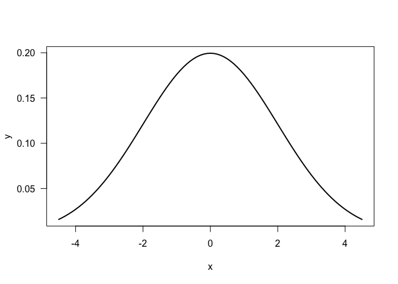
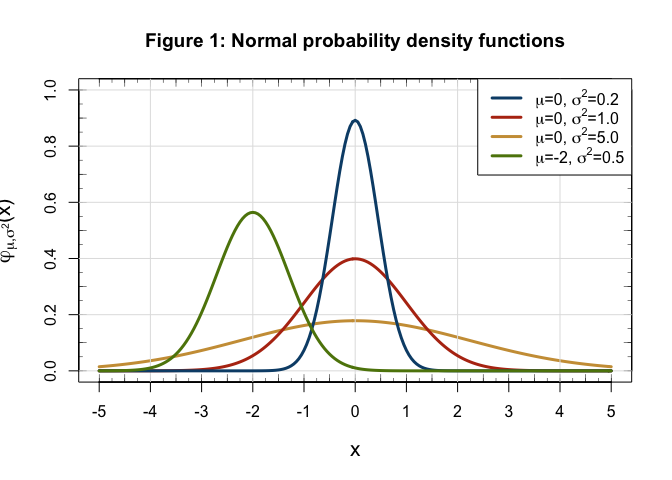

warmup05-hongling-lei
================

``` r
library(ggplot2)
```

    ## Warning: package 'ggplot2' was built under R version 3.4.4

1) Function gaussian()
----------------------

``` r
#' @title gaussian function
#' @description computes probability density of a normal distribution
#' @param x numeric vector for x (default 0)
#' @param m numeric vector for μ, mean (default 0)
#' @param s numeric vector for σ, standard deviation (default 1)
#' @return computed probability fensity

gaussian <- function(x = 0, m = 0, s = 1){
  if (s <= 0){
    stop("s must be greater than zero")
  }
  g = 1/(s*sqrt(2*pi)) * ((exp(1))^(-1/2*((x-m)/s)^2))
  return(g)
}

# test set 1
gaussian(x = 0, m = 0, s = 1)
```

    ## [1] 0.3989423

``` r
gaussian(x = 1, m = 0, s = 2)
```

    ## [1] 0.1760327

``` r
# test set 2
gaussian(x = 1, m = 0, s = 0)
```

    ## Error in gaussian(x = 1, m = 0, s = 0): s must be greater than zero

``` r
gaussian(x = 1, m = 0, s = -1)
```

    ## Error in gaussian(x = 1, m = 0, s = -1): s must be greater than zero

``` r
# gaussian curve
x <- seq(from = -4.5, to = 4.5, by = 0.1)
y <- gaussian(x, m = 0, s = 2)
plot(x, y, las = 1, type = "l", lwd = 2)
```



``` r
x = seq(from = -5, to = 5, by = 0.05)
y1 = gaussian(x, m = 0, s = sqrt(0.2))
y2 = gaussian(x, m = 0, s = sqrt(1))
y3 = gaussian(x, m = 0, s = sqrt(5))
y4 = gaussian(x, m = -2, s = sqrt(0.5))

l1 = expression(paste(mu, "=0, ", sigma^2, "=0.2"))
l2 = expression(paste(mu, "=0, ", sigma^2, "=1.0"))
l3 = expression(paste(mu, "=0, ", sigma^2, "=5.0"))
l4 = expression(paste(mu, "=-2, ", sigma^2, "=0.5")) 

plot(x,y3, type = "l", lwd=3,
     ylab = expression(paste(varphi[mu][","][sigma^2],"(x)")),
     xlab="x", ylim=c(0,1), col = "#cc9d44", cex.lab = 1.3)
# add separations in axes
axis(side = 1, at = seq(-5, 5, 0.25), labels = FALSE, lwd.ticks = 0.5, tcl = 0.2)
axis(side = 1, at = seq(-5, 5, 0.5), labels = FALSE, lwd.ticks = 0.5, tcl = 0.4)
axis(side = 2, at = seq(0.0, 1.0, 0.05), labels = FALSE, lwd.ticks = 0.5, tcl = 0.2)
axis(side = 2, at = seq(0.0, 1.0, 0.1), labels = FALSE, lwd.ticks = 0.5, tcl = 0.4)
axis(side = 3, at = seq(-5, 5, 0.25), labels = FALSE, lwd.ticks = 0.5, tcl = 0.2)
axis(side = 3, at = seq(-5, 5, 0.5), labels = FALSE, lwd.ticks = 0.5, tcl = 0.4)
axis(side = 4, at = seq(0.0, 1.0, 0.05), labels = FALSE, lwd.ticks = 0.5, tcl = 0.2)
axis(side = 4, at = seq(0.0, 1.0, 0.1), labels = FALSE, lwd.ticks = 0.5, tcl = 0.4)
axis(side = 1, at=seq(-5,5,2))

# add grid in the background
grid(nx = NULL, ny = NULL, col = "#e1e1e1", lty = "solid", lwd = 1, equilogs = TRUE)

lines(x, y2, col="#b63414", lwd=3)
lines(x, y1, col="#0b4d77", lwd=3)
lines(x, y4, col="#5d820a", lwd=3)

legend("topright", legend = c(l1,l2,l3,l4), 
       col = c("#0b4d77", "#b63414", "#cc9d44", "#5d820a"), lty = "solid", lwd = 3, cex = 1)
title(main = "Figure 1: Normal probability density functions")
```



2) Discriptive Statistics
-------------------------

``` r
#' @title descriptive function
#' @description displays descriptive statistics of a numeric vector
#' @param x numeric vector for x (default 0)
#' @param na.rm whether to remove missing values before computations (default FALSE)
#' @return a named vector with computed summary statistics 

descriptive <- function(x = 0, na.rm = FALSE){
  if (class(x) != "numeric"){
    stop("The input vector should be numeric.")
  }
  summary = c(min = min(x, na.rm = na.rm), 
              q1 = quantile(x, 0.25, na.rm = na.rm),
              median = median(x, na.rm = na.rm),
              mean = mean(x, na.rm = na.rm),
              q3 = quantile(x, 0.75, na.rm = na.rm),
              max = max(x, na.rm = na.rm),
              range = max(x, na.rm = na.rm) - min(x, na.rm = na.rm),
              iqr = IQR(x, na.rm = na.rm),
              sd = sd(x, na.rm = na.rm))
  return(summary)
}
```

``` r
# input vectors
set.seed(100)
x <- rnorm(100)
y <- x
y[sample(1:100, size = 10)] <- NA

# test set 1
descriptive(x)
```

    ##          min       q1.25%       median         mean       q3.75% 
    ## -2.271925486 -0.608846594 -0.059419897  0.002912563  0.655891078 
    ##          max        range          iqr           sd 
    ##  2.581958928  4.853884414  1.264737672  1.020710369

``` r
descriptive(y)
```

    ## Error in quantile.default(x, 0.25, na.rm = na.rm): missing values and NaN's not allowed if 'na.rm' is FALSE

``` r
descriptive(y, na.rm = TRUE)
```

    ##          min       q1.25%       median         mean       q3.75% 
    ## -2.271925486 -0.548412556  0.007231179  0.063795660  0.713294929 
    ##          max        range          iqr           sd 
    ##  2.581958928  4.853884414  1.261707485  1.011066651

``` r
descriptive(letters)
```

    ## Error in descriptive(letters): The input vector should be numeric.

``` r
# test set 2
a <- descriptive(x)
class(a)
```

    ## [1] "numeric"

``` r
length(a)
```

    ## [1] 9

``` r
names(a)
```

    ## [1] "min"    "q1.25%" "median" "mean"   "q3.75%" "max"    "range"  "iqr"   
    ## [9] "sd"

3) Minkowski Distance
---------------------

``` r
#' @title minkowski function
#' @description calculates the minkowski distance of two points
#' @param x numeric vector for one point
#' @param y numeric vector for the other point
#' @param p either a numeric value greater than 1, or a character string "max" (default 1)
#' @return computed distance

minkowski <- function(x, y, p = 1){
  if (length(x) != length(y)){
    stop("x and y have different lengths")
  }
    if (class(p) == "character" & p!= "max"){
    stop("invalid character value for p")
  }
  if (class(p) == "numeric" & p < 1){
    stop("p cannot be less than 1")
  } # finished all the possible error situations
  distance = 0 # initial value
  if (class(p) == "character" & p == "max"){
    for (i in 1:length(x)){
      distance = max(distance, abs(x[i] - y[i]))
    }
  }
  if(class(p) == "numeric" & p >= 1){
    for (i in 1:length(x)){
      distance = distance + (abs(x[i] - y[i]))^p
    }
    distance = distance^(1/p)
  }
  return(distance)
}
```

``` r
# some points
point1 <- c(0,0)
point2 <- c(1,1)
point3 <- sqrt(c(2,2))
point4 <- c(0,1)
point5 <- c(1,1,1)

# test set 1
minkowski(point1, point2, p = 1)
```

    ## [1] 2

``` r
minkowski(point1, point3, p = 2)
```

    ## [1] 2

``` r
minkowski(point1, point2, p = "max")
```

    ## [1] 1

``` r
# test set 2
minkowski(point4, point5, p = 1)
```

    ## Error in minkowski(point4, point5, p = 1): x and y have different lengths

``` r
minkowski(point1, point2, p = 0.5)
```

    ## Error in minkowski(point1, point2, p = 0.5): p cannot be less than 1

``` r
minkowski(point1, point2, p = "min")
```

    ## Error in minkowski(point1, point2, p = "min"): invalid character value for p
