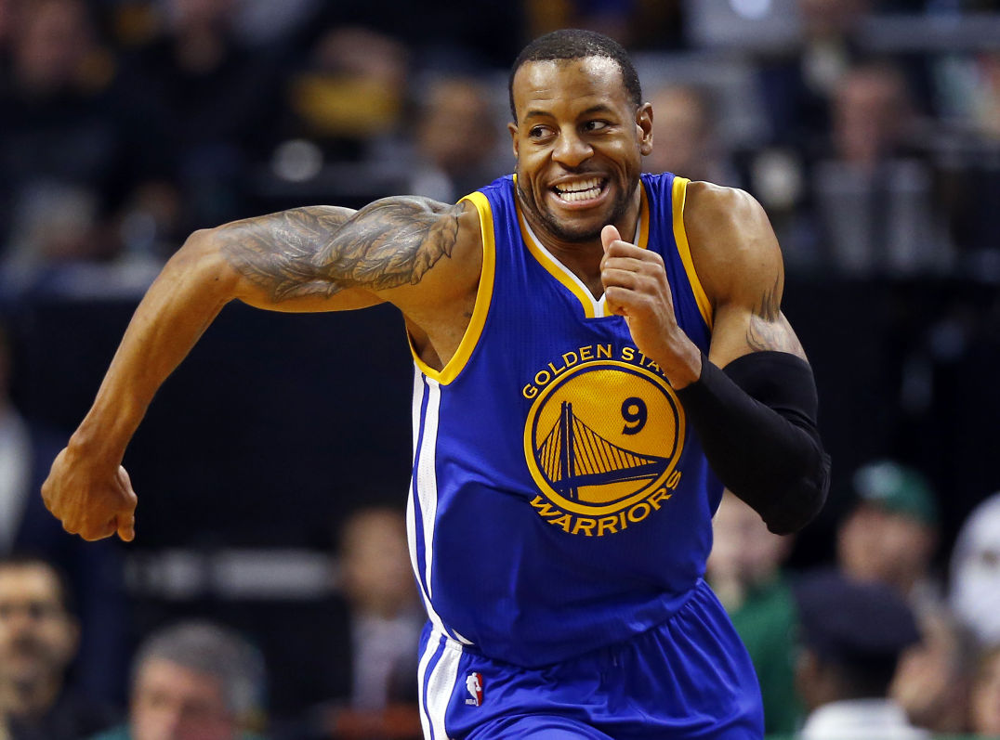
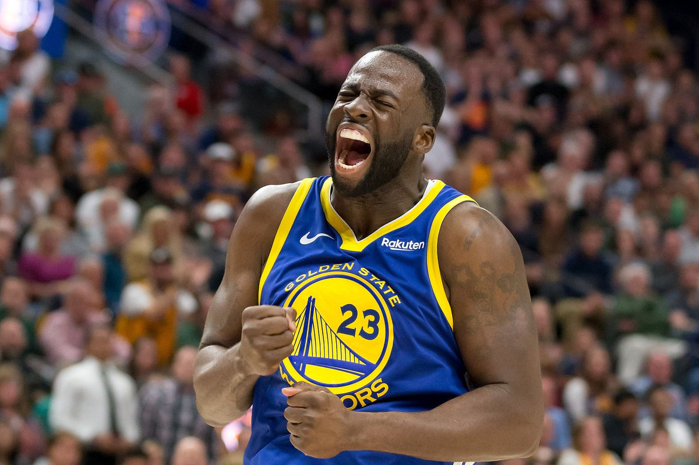
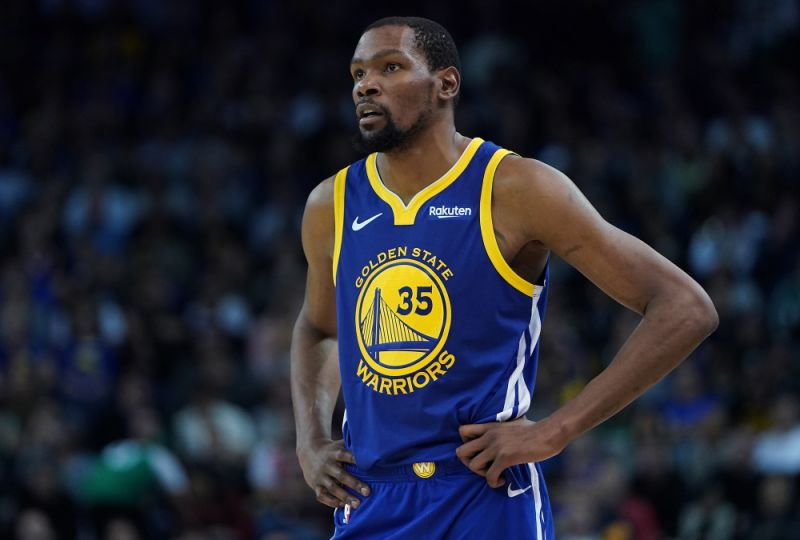
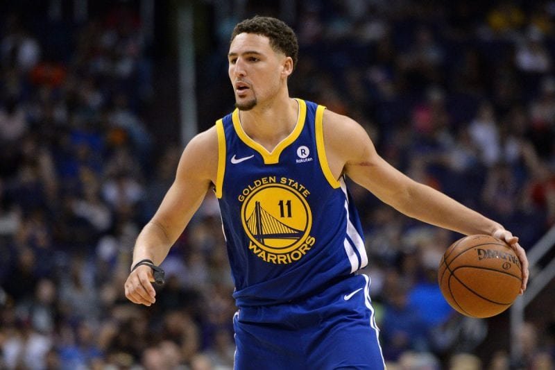
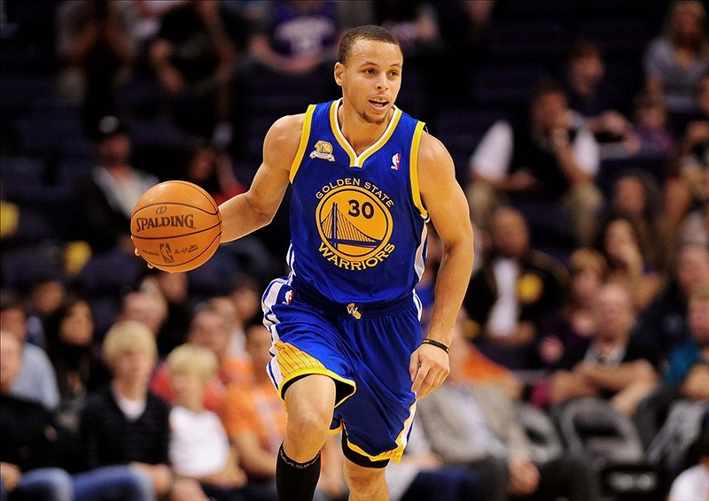
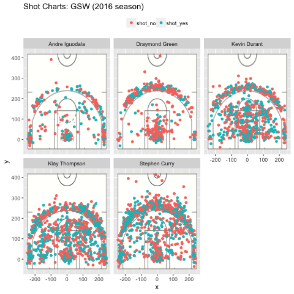

workout 1
================
Hongling Lei

Introduction
------------

A big fan of basketball? Sure, who in California doesn't like our legendary Golden State Warriors! <sup>\[1\]</sup>


But besides just simply enjoying watching the game, have you ever thought about why they succeed, what the strengths and weakness of each player are, and how their previous shots data can help improve the team's future performance? Probably not. Don't worry, that's what exactly this article is going to tell you.

Motivation
----------

Visual observation is not always trustworthy due to lack of accuracy. It's hard to convince people that a certain player is better than another by just saying, hey I remember seeing him make more shots than the other guy. The absolute number of shots made is important for sure, but we also need to have a look at the total shots the player attempted to make and the percentage of successful ones. Also we should classify the data by shot types; making a 2 point shot is obviously different from making a 3 point one.

Due to the limitations of simple visual observation and inference, data analysis with statistical tools becomes essential. By manipulating, plotting and analyzing previous data, we can have a more reliable and accurate understanding of each player's strengths and weaknesses. This can help improve the performance of the whole team, as we can better adjust the position of each player based on that.

Background
----------

Golden State Warriors is an American professional basketball team based in Oakland, California, that plays in the Western Conference of the National Basketball Association (NBA). The Warriors have won five NBA championships (1956, 1975, 2015, 2017, and 2018) and one Basketball Association of America (BAA) title (1947). <sup>\[2\]</sup>

In this article we mainly analyze the performance of the following players. Here's a brief introduction of them:

### Andre Iguodala <sup>\[3\]</sup>

-   Age: 35
-   Playing career: 2004-present
-   Position: SF, SG



### Draymond Green <sup>\[4\]</sup>

-   Age: 29
-   Playing career: 2012-present
-   Position: PF, C



### Kevin Durant <sup>\[5\]</sup>

-   Age: 30
-   Playing career: 2007-present
-   Position: PF



### Klay Thompson <sup>\[6\]</sup>

-   Age: 29
-   Playing career: 2011-present
-   Position: SF, SG



### Stephen Curry <sup>\[7\]</sup>

-   Age: 30
-   Playing career: 2009-present
-   Position: PG, SG



Data
----

However, Golden State Warriors didn't do a very impressive job in the 2016 season as people expected. So we're using data from the 2016 season to analyze what on earth went wrong and how they could improve in the following years.

The dataset we use includes the following variables:

-   **period**: an NBA game is divided in 4 periods of 12 mins each. For example, a value for period = 1 refers to the first period (the first 12 mins of the game).
-   **minutes\_remaining** and **seconds\_remaining** have to do with the amount of time in minutes and seconds, respectively, that remained to be played in a given period.
-   **shot\_made\_flag** indicates whether a shot was made (y) or missed (n).
-   **action\_type** has to do with the basketball moves used by players, either to pass by defenders to gain access to the basket, or to get a clean pass to a teammate to score a two pointer or three pointer.
-   **shot\_type** indicates whether a shot is a 2-point field goal, or a 3-point field goal.
-   **shot\_distance**: distance to the basket (measured in feet).
-   **x** and **y** refer to the court coordinates (measured in inches) where a shot occurred .

We imported shots data of five major players - **Andre Iguodala**, **Graymond Green**, **Kevin Durant**, **Klay Thompson** and **Stephen Curry** - added a name column in each of the files. We also prepared a merged dataset by putting the data of all the five players together. Similarly, we plotted both the shots for each player separately and the shots of the whole team. This way, readers can easily see the contribution of each player and make comparisons.

Analysis
--------

Below is a graph of each player's performance.



As the legend explains, green dots represent successful shots made while red ones are not successful. The background represents the NBA court, and the positions of the dots show from where the player threw the basketball.

We can see that Andre and Draymond threw relatively small numbers of shots compared to Kevin, Klay and Stephen. This somewhat matches their positions in the team. Also Kevin, Klay and Stephen seem to be good at giving shots from anywhere, while Andre and Draymond are not as impressive when it comes to long-distance shots.

To further prove our guess, we used statistical tools to calculate total shots, shots made, and the percentage of shots made for each player, categorized by shot types.

Here are the codes and results:

``` r
library(dplyr) # we'll use the "dplyr" package
```

    ## Warning: package 'dplyr' was built under R version 3.4.4

    ## 
    ## Attaching package: 'dplyr'

    ## The following objects are masked from 'package:stats':
    ## 
    ##     filter, lag

    ## The following objects are masked from 'package:base':
    ## 
    ##     intersect, setdiff, setequal, union

``` r
shots = read.csv("../data/shots_data.csv")
shots$name = as.character(shots$name) # to make sure it can be grouped by
```

### 2PT Effective Shooting % by Player

``` r
table_2pt = arrange(summarise(group_by(shots, name),
                  total = sum(shot_type == "2PT Field Goal"),
                  made = sum(shot_type == "2PT Field Goal" & shot_made_flag == "shot_yes"),
                  perc_made = made/total), desc(perc_made))
knitr::kable(table_2pt, caption = "2PT Effective Shooting Percentage by Player")
```

| name           |  total|  made|  perc\_made|
|:---------------|------:|-----:|-----------:|
| Andre Iguodala |    210|   134|   0.6380952|
| Kevin Durant   |    643|   390|   0.6065319|
| Stephen Curry  |    563|   304|   0.5399645|
| Klay Thompson  |    640|   329|   0.5140625|
| Draymond Green |    346|   171|   0.4942197|

As for 2-point shots, Andre Iguodala did the best job. Although he had the smallest number of shots made (134) among the five players, he had the highest percentage of 2-point shots made (63.8%). Draymond Green was worst at giving 2-point shots if measured by the probability of a successful shot (49.4%).

### 3PT Effective Shooting % by Player

``` r
table_3pt = arrange(summarise(group_by(shots, name),
                  total = sum(shot_type == "3PT Field Goal"),
                  made = sum(shot_type == "3PT Field Goal" & shot_made_flag == "shot_yes"),
                  perc_made = made/total), desc(perc_made))
knitr::kable(table_3pt, caption = "2PT Effective Shooting Percentage by Player")
```

| name           |  total|  made|  perc\_made|
|:---------------|------:|-----:|-----------:|
| Klay Thompson  |    580|   246|   0.4241379|
| Stephen Curry  |    687|   280|   0.4075691|
| Kevin Durant   |    272|   105|   0.3860294|
| Andre Iguodala |    161|    58|   0.3602484|
| Draymond Green |    232|    74|   0.3189655|

As for 3-point shots, however, things have changed. Klay Thompson proved to be the best at making 3-point shots, since he had the highest percentage of 3-point shots made (42.4%). Draymond Green was still the worst at giving 3-point shots if measured by the probability of a successful shot (31.9%).

We can see that on average the percentages of 3-points shots made are lower than those of the 2-point ones. This is straightforward; throwing a ball from a long distance away is obviously harder than doing that from somewhere near the basket.

### Overall Effective Shooting % by Player

``` r
table_overall = arrange(summarise(group_by(shots, name),
                  total = sum(shot_made_flag == "shot_yes" | shot_made_flag == "shot_no"),
                  made = sum(shot_made_flag == "shot_yes"),
                  perc_made = made/total), desc(perc_made))
knitr::kable(table_overall, caption = "2PT Effective Shooting Percentage by Player")
```

| name           |  total|  made|  perc\_made|
|:---------------|------:|-----:|-----------:|
| Kevin Durant   |    915|   495|   0.5409836|
| Andre Iguodala |    371|   192|   0.5175202|
| Klay Thompson  |   1220|   575|   0.4713115|
| Stephen Curry  |   1250|   584|   0.4672000|
| Draymond Green |    578|   245|   0.4238754|

Finally let's take into consideration of both 2- and 3-point shots and look at the overall successful rate. From the highest to the lowest, the players are Kevin, Andre, Klay, Stephen and Draymond, with the best percentage of 54.1% and the worst of 42.4%.

Discussion
----------

The results are intersting if we look at the three tables together and take the players' positions into consideration. We can see that Kevin was neither the best at giving 2-point shots or the best at giving 3-point shots, but he had the highest overall probability of making shots. If we look more carefully at the previous two tables, we can find that Kevin actually both pretty well in making both 2- and 3-point shots (he was just not the best one, but still quite good), while others were only very impressive at one kind. For example, Andre was the best at 2-point shots but he ranked the 4th at 3-point shot; Klay was the best at 3-point shots but he ranked the 4th at 2-point shots. This kind of imbalance explains why Kevin did the best at the overall level.

As for Draymond, it is easy to understand why he did the worst in overall shots, because he ranked the last at both 2-point and 3-point shots.

Conclusion
----------

People should specialize to make full use of their comparative advantage, and then collaborate to make the whole team work the best. The best 2-point shot maker is not necessarily the best 3-point shot maker, and there is no need for them to be perfect at both. Andre should focus on making 2-point shots and Klay should concentrate on making 3-point ones because they're best at each. Kevin, the one with neither too good nor too bad performance at each shot types, can be more flexible during the game.

Thank you for reading this report.

References
----------

<sup>\[1\]</sup> [Photo of Golden State Warriors](https://onairstory.com/the-golden-state-warriors-are-rumored-to-be-resigning-andrew-bogut-in-the-team/)

<sup>\[2\]</sup> [Golden State Warriors, Adam Augustyn, 2019](https://www.britannica.com/topic/Golden-State-Warriors)

<sup>\[3\]</sup> [Andre Iguodala's photo](https://tucson.com/andre-iguodala/article_2f347934-c9c1-11e4-8664-4b3cb77c1e79.html)

<sup>\[4\]</sup> [Draymond Green's photo](https://www.sbnation.com/nba/2018/11/14/18094749/draymond-green-kevin-durant-bitch-suspension-warriors-gmib)

<sup>\[5\]</sup> [Kevin Durant's photo](https://sports.yahoo.com/kevin-durant-injured-ankle-left-early-in-golden-state-warriors-loss-to-phoenix-suns-030123926.html)

<sup>\[6\]</sup> [Klay Thompson's photo](https://basketballsocietyonline.com/klay-thompson-warriors-nba)

<sup>\[7\]</sup> [Stephen Curry's photo](https://www.blackenterprise.com/under-armour-releases-new-orleans-inspired-shoe-for-stephen-curry/)
