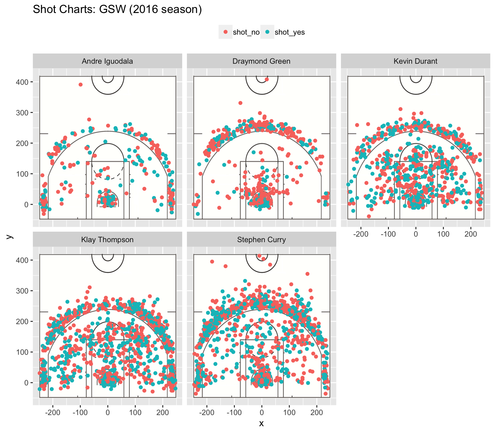

workout 1
================
Hongling Lei



#### 5.1) Effective Shooting Percentage

``` r
library(dplyr)
```

    ## Warning: package 'dplyr' was built under R version 3.4.4

    ## 
    ## Attaching package: 'dplyr'

    ## The following objects are masked from 'package:stats':
    ## 
    ##     filter, lag

    ## The following objects are masked from 'package:base':
    ## 
    ##     intersect, setdiff, setequal, union

``` r
shots = read.csv("../data/shots_data.csv")
shots$name = as.character(shots$name) # to make sure it can be grouped by
```

**2PT Effective Shooting % by Player**

``` r
table_2pt = arrange(summarise(group_by(shots, name),
                  total = sum(shot_type == "2PT Field Goal"),
                  made = sum(shot_type == "2PT Field Goal" & shot_made_flag == "shot_yes"),
                  perc_made = made/total), desc(perc_made))
table_2pt
```

    ## # A tibble: 5 x 4
    ##   name           total  made perc_made
    ##   <chr>          <int> <int>     <dbl>
    ## 1 Andre Iguodala   210   134     0.638
    ## 2 Kevin Durant     643   390     0.607
    ## 3 Stephen Curry    563   304     0.540
    ## 4 Klay Thompson    640   329     0.514
    ## 5 Draymond Green   346   171     0.494

**3PT Effective Shooting % by Player**

``` r
table_3pt = arrange(summarise(group_by(shots, name),
                  total = sum(shot_type == "3PT Field Goal"),
                  made = sum(shot_type == "3PT Field Goal" & shot_made_flag == "shot_yes"),
                  perc_made = made/total), desc(perc_made))
table_3pt
```

    ## # A tibble: 5 x 4
    ##   name           total  made perc_made
    ##   <chr>          <int> <int>     <dbl>
    ## 1 Klay Thompson    580   246     0.424
    ## 2 Stephen Curry    687   280     0.408
    ## 3 Kevin Durant     272   105     0.386
    ## 4 Andre Iguodala   161    58     0.360
    ## 5 Draymond Green   232    74     0.319

**Effective Shooting % by Player**

``` r
table_overall = arrange(summarise(group_by(shots, name),
                  total = sum(shot_made_flag == "shot_yes" | shot_made_flag == "shot_no"),
                  made = sum(shot_made_flag == "shot_yes"),
                  perc_made = made/total), desc(perc_made))
table_overall
```

    ## # A tibble: 5 x 4
    ##   name           total  made perc_made
    ##   <chr>          <int> <int>     <dbl>
    ## 1 Kevin Durant     915   495     0.541
    ## 2 Andre Iguodala   371   192     0.518
    ## 3 Klay Thompson   1220   575     0.471
    ## 4 Stephen Curry   1250   584     0.467
    ## 5 Draymond Green   578   245     0.424
